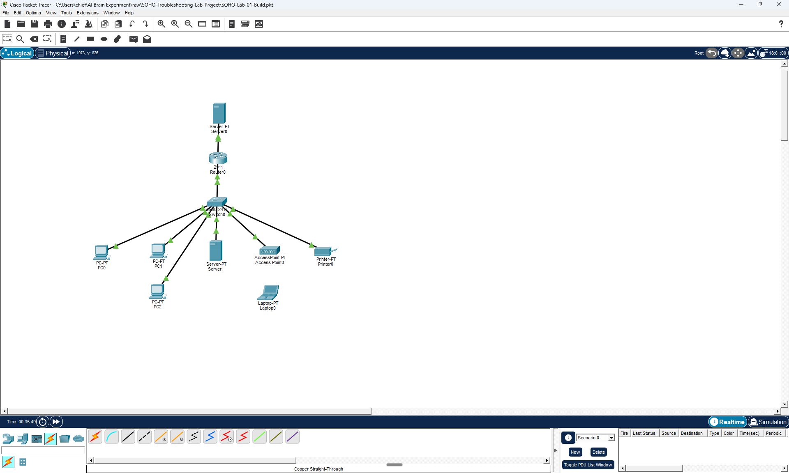

# SOHO Network Troubleshooting Lab (Cisco Packet Tracer)

A hands-on Tier 1 and desktop support troubleshooting portfolio. I built a small-office network in Cisco Packet Tracer, broke it eight different ways, and documented the full help-desk workflow for each break: user-reported symptom, diagnostic steps with CLI evidence, root cause, fix, and verification.

When a user walks up to my desk and says *"my computer isn't working"*, this project shows how I get from symptom to fix: evidence-driven, structured, and documented so someone else can follow the same path.

---

## What this project demonstrates

- **Structured troubleshooting**: symptom → clarifying questions → evidence gathering → root cause → fix → verification
- **Core diagnostic commands**: `ipconfig`, `ping`, `tracert`, `nslookup`, `arp`, and the Cisco IOS `show` family
- **OSI-model reasoning**: every diagnosis moves through the layers (cable → link → VLAN → IP → DNS → application)
- **Professional documentation**: each ticket is a complete writeup a coworker or auditor could follow
- **Tool-awareness**: notes on where Packet Tracer's simulation differs from real-world Windows and Cisco behavior, and how I adapted

---

## The network



**Equipment:**
- 1× Cisco 2911 router (Router0): router-on-a-stick, inter-VLAN routing, DHCP server
- 1× Cisco 2960 switch (Switch0): access layer, 802.1Q trunk to router
- 1× Access Point (Access Point0): WPA2-PSK guest Wi-Fi
- 2× Servers: Server0 (internet simulator and DNS), Server1 (internal)
- 3× PCs (PC0, PC1, PC2): wired clients across IT and Staff VLANs
- 1× Laptop (Laptop0): wireless client on guest VLAN
- 1× Printer (Printer0): networked print device

**VLAN / IP plan:**

| VLAN | Name | Subnet | Gateway | Purpose |
|------|------|--------|---------|---------|
| 10 | IT | 192.168.10.0/24 | 192.168.10.1 | Servers, IT staff |
| 20 | Staff | 192.168.20.0/24 | 192.168.20.1 | General employees, printer |
| 30 | Guest | 192.168.30.0/24 | 192.168.30.1 | Guest Wi-Fi (Laptop0) |
| — | WAN | 203.0.113.0/30 | 203.0.113.1 (Server0) | Uplink to "internet" simulator |

---

## Skills demonstrated

Cisco IOS command-line interface (CLI), router-on-a-stick inter-VLAN routing, Virtual Local Area Network (VLAN) design and 802.1Q trunking, Dynamic Host Configuration Protocol (DHCP) scope and pool troubleshooting, Domain Name System (DNS) client and server troubleshooting, Wireless Protected Access II Pre-Shared Key (WPA2-PSK) authentication, Address Resolution Protocol (ARP) behavior and Proxy ARP, IP addressing and subnet mask analysis, static routing and default-route dependencies, ticket documentation and service-level agreement (SLA) workflow, Windows command-line diagnostics (`ipconfig`, `ping`, `tracert`, `nslookup`, `arp`), Cisco `show` commands (`show ip route`, `show ip interface brief`, `show ip dhcp pool`, `show vlan brief`, `show interfaces switchport`, `show interfaces status`).

---

## The tickets

Each ticket is a self-contained writeup with symptom, diagnosis (with screenshots at every step), root cause, fix, and verification. Click a ticket title to read the full writeup.

| # | Scenario | Root cause | Severity |
|---|----------|------------|----------|
| [**T01: I can't get on the internet or the shared drive**](tickets/T01-wrong-gateway.md) | Off-subnet destinations unreachable from one PC | PC's default gateway set to a non-existent address | Sev-C |
| [**T02: My PC got a weird 169 address and nothing works**](tickets/T02-dhcp-pool-missing.md) | PCs in one VLAN can't get DHCP leases | DHCP pool deleted from router | Sev-B |
| [**T03: I can ping the server but websites won't load**](tickets/T03-bad-dns.md) | IP-based traffic works, name resolution fails | DNS server IP misconfigured on client | Sev-C |
| [**T04: I can see the guest Wi-Fi but it won't let me connect**](tickets/T04-wrong-wifi-psk.md) | Wi-Fi SSID visible, authentication silently fails | AP's WPA2 PSK changed | Sev-C |
| [**T05: The new hire's PC won't connect to anything**](tickets/T05-wrong-vlan.md) | Single PC can't get DHCP despite green link lights | Switchport in undefined VLAN | Sev-C |
| [**T06: Printer is offline, nobody can print**](tickets/T06-port-shutdown.md) | Printer unreachable, red link light on switch | Switchport administratively shut down | Sev-B |
| [**T07: I can't get on the guest Wi-Fi**](tickets/T07-wrong-ssid.md) | Expected Wi-Fi SSID doesn't appear in scan | SSID renamed on AP | Sev-C |
| [**T08: We can reach internal stuff but can't get to the internet**](tickets/T08-wan-interface-down.md) | Internal reachable, external fails, tracert dies at edge router | WAN interface shut down on router | Sev-A |

---

## How I worked each ticket

Every ticket followed the same pattern:

1. **Save the known-good `SOHO-Lab-01-Build.pkt` → Save As** a new file named for the ticket.
2. **Apply the break** and save the file. This freezes the broken state on disk. The `SOHO-Lab-01-t0X.pkt` files in `packet-tracer-files/` are the scenarios, not the solutions.
3. **Play the user**: read the symptom aloud and write down clarifying questions I'd ask in a real ticket intake.
4. **Diagnose**: run commands in logical OSI order, capture screenshots as I go, note what each result does and doesn't tell me.
5. **Identify root cause** and phrase it in one sentence a non-technical manager would understand.
6. **Apply the fix** and run a **verification pass** confirming the symptom is gone.
7. **Write up the ticket**. The 8 linked writeups above are the result.

---

## Tool-awareness notes (things I learned while building this)

Packet Tracer is a simulator, and some behaviors differ from real-world Windows and Cisco IOS. Three discoveries from this project I'd flag to a teammate:

1. **PT shows `0.0.0.0`, not APIPA, when DHCP fails.** Real Windows falls back to a `169.254.x.x` APIPA address; Packet Tracer just leaves everything at `0.0.0.0` with repeated `DHCP request failed.` messages. Same underlying state, different surface presentation. Knowing this matters when you move between the simulator and real help desk tickets.

2. **Cisco routers have Proxy ARP enabled by default**, which silently "fixes" some client-side misconfigurations that should otherwise fail. I originally planned a wrong-subnet-mask ticket where a client misjudges which IPs are local. That should, in theory, break cross-VLAN pings, but Proxy ARP steps in, responds to the client's ARP on behalf of the remote host, and the ping works anyway. I redesigned that ticket rather than disable Proxy ARP network-wide.

3. **Packet Tracer blocks duplicate-IP static configurations at input time**, displaying *"This address is already used in the network"* and refusing the value. This mimics how some modern OS stacks do ARP-probe before committing a static IP, but it means the classic "two devices with the same IP" ticket can't be reproduced the traditional way in PT. I swapped that scenario for a WPA2 authentication failure instead.

I see these adaptations as evidence I hit real tooling constraints and adapted rather than giving up on the approach.

---

## Running this lab yourself

1. Install **Cisco Packet Tracer** (free via Cisco NetAcad) version 8.x or newer.
2. Clone this repo: `git clone https://github.com/zackaryr1/packet-tracer-soho-lab.git`
3. Open `packet-tracer-files/SOHO-Lab-01-Build.pkt` for the known-good working state (all DHCP, DNS, VLANs, and inter-VLAN routing fully configured).
4. Open any `SOHO-Lab-01-t0X.pkt` to load the broken state for the corresponding ticket (`t01` = Ticket #T01, etc.), then walk through the diagnosis and apply the fix documented in the ticket's writeup.

All tickets are reproducible end-to-end in under 5 minutes each.

### Build it yourself from scratch

Prefer to build the whole network from an empty Packet Tracer workspace? The full step-by-step walkthrough is here: **[SOHO Troubleshooting Lab Guide](SOHO-Troubleshooting-Lab-Guide.md)** — every device placement, cable, CLI command, and break recipe, tested end-to-end on Packet Tracer 8.2.

---

## Repository contents

```
packet-tracer-soho-lab/
├── README.md                                       (this file, lab overview)
├── SOHO-Troubleshooting-Lab-Guide.md               (full build-it-yourself walkthrough)
├── tickets/                                        (full writeup for each ticket)
│   ├── T01-wrong-gateway.md
│   ├── T02-dhcp-pool-missing.md
│   ├── T03-bad-dns.md
│   ├── T04-wrong-wifi-psk.md
│   ├── T05-wrong-vlan.md
│   ├── T06-port-shutdown.md
│   ├── T07-wrong-ssid.md
│   └── T08-wan-interface-down.md
├── packet-tracer-files/                            (Packet Tracer save files)
│   ├── SOHO-Lab-01-Build.pkt                       known-good working topology
│   ├── SOHO-Lab-01-t01.pkt                         broken state for T01 (wrong default gateway)
│   ├── SOHO-Lab-01-t02.pkt                         broken state for T02 (DHCP pool missing)
│   ├── SOHO-Lab-01-t03.pkt                         broken state for T03 (bad DNS on client)
│   ├── SOHO-Lab-01-t04.pkt                         broken state for T04 (wrong Wi-Fi PSK)
│   ├── SOHO-Lab-01-t05.pkt                         broken state for T05 (wrong VLAN on port)
│   ├── SOHO-Lab-01-t06.pkt                         broken state for T06 (switchport shutdown)
│   ├── SOHO-Lab-01-t07.pkt                         broken state for T07 (wrong SSID)
│   └── SOHO-Lab-01-t08.pkt                         broken state for T08 (WAN interface down)
└── screenshots/                                    (all evidence captures)
    ├── 01-build-*.png through 12-baseline-*.png    environment buildout + baseline tests
    └── t01-*.png through t08-*.png                 per-ticket diagnostic evidence
```

---

## About this portfolio

I'm [Zackary Ramcharam](https://linkedin.com/in/zackary-ramcharam), an Information Technology graduate from the University of Central Florida (UCF), looking to break into IT. Other labs I've built:

- [active-directory-aws-lab](https://github.com/zackaryr1/active-directory-aws-lab): cloud-based Active Directory domain environment
- [osticket-azure-lab](https://github.com/zackaryr1/osticket-azure-lab): production-style IT help desk on Azure

Reach me at **zramcharam@gmail.com** or via [LinkedIn](https://linkedin.com/in/zackary-ramcharam).
