# SOHO Network Troubleshooting Lab (Cisco Packet Tracer)

A hands-on Tier 1 / desktop support troubleshooting portfolio. I built a small-office network in Cisco Packet Tracer, deliberately broke it eight different ways, and documented the full help-desk workflow for each break — user-reported symptom, diagnostic steps with CLI evidence, root cause, fix, and verification.

The goal of this project is not to show that I can build a network. It's to show that when a user walks up to my desk and says *"my computer isn't working"*, I can get from symptom to fix with a structured, evidence-driven process.

---

## What this project demonstrates

- **Structured troubleshooting** — symptom → clarifying questions → evidence gathering → root cause → fix → verification
- **Core diagnostic commands** — `ipconfig`, `ping`, `tracert`, `nslookup`, `arp`, and the Cisco IOS `show` family
- **OSI-model reasoning** — every diagnosis moves deliberately through layers (cable → link → VLAN → IP → DNS → application)
- **Professional documentation** — each ticket is a complete writeup a coworker or auditor could follow
- **Tool-awareness** — honest notes about where Packet Tracer's simulation differs from real-world Windows / Cisco behavior, and how I adapted

---

## The network


**Equipment:**
- 1× Cisco 2911 router (Router0) — router-on-a-stick, inter-VLAN routing, DHCP server
- 1× Cisco 2960 switch (Switch0) — access layer, 802.1Q trunk to router
- 1× Access Point (Access Point0) — WPA2-PSK guest Wi-Fi
- 2× Servers — Server0 (internet simulator / DNS), Server1 (internal)
- 3× PCs (PC0, PC1, PC2) — wired clients across IT and Staff VLANs
- 1× Laptop (Laptop0) — wireless client on guest VLAN
- 1× Printer (Printer0) — networked print device

**VLAN / IP plan:**

| VLAN | Name | Subnet | Gateway | Purpose |
|------|------|--------|---------|---------|
| 10 | IT | 192.168.10.0/24 | 192.168.10.1 | Servers, IT staff |
| 20 | Staff | 192.168.20.0/24 | 192.168.20.1 | General employees, printer |
| 30 | Guest | 192.168.30.0/24 | 192.168.30.1 | Guest Wi-Fi (Laptop0) |
| — | WAN | 203.0.113.0/30 | 203.0.113.1 (Server0) | Uplink to "internet" simulator |

---

## Skills demonstrated

Cisco IOS command-line interface (CLI), router-on-a-stick inter-VLAN routing, Virtual Local Area Network (VLAN) design and 802.1Q trunking, Dynamic Host Configuration Protocol (DHCP) scope and pool troubleshooting, Domain Name System (DNS) client and server troubleshooting, Wireless Protected Access II — Pre-Shared Key (WPA2-PSK) authentication, Address Resolution Protocol (ARP) behavior and Proxy ARP, IP addressing and subnet mask analysis, static routing and default-route dependencies, ticket documentation and service-level agreement (SLA) workflow, Windows command-line diagnostics (`ipconfig`, `ping`, `tracert`, `nslookup`, `arp`), Cisco `show` commands (`show ip route`, `show ip interface brief`, `show ip dhcp pool`, `show vlan brief`, `show interfaces switchport`, `show interfaces status`).

---

## Tickets at a glance

| # | Scenario | Root cause | Layer |
|---|----------|------------|-------|
| [T01](#t01--i-cant-get-on-the-internet-or-the-shared-drive) | Off-subnet destinations unreachable from one PC | PC's default gateway set to a non-existent address | L3 (client) |
| [T02](#t02--my-pc-got-a-weird-169-address-and-nothing-works) | PCs in one VLAN can't get DHCP leases | DHCP pool deleted from router | L3 (router DHCP) |
| [T03](#t03--i-can-ping-the-server-but-websites-wont-load) | IP-based traffic works, name resolution fails | DNS server IP misconfigured on client | L7 (DNS) |
| [T04](#t04--i-can-see-the-guest-wi-fi-but-it-wont-let-me-connect) | Wi-Fi SSID visible, authentication silently fails | AP's WPA2 PSK changed | L2 (wireless auth) |
| [T05](#t05--the-new-hires-pc-wont-connect-to-anything) | Single PC can't get DHCP despite green link lights | Switchport in undefined VLAN | L2 (switchport) |
| [T06](#t06--printer-is-offline--nobody-can-print) | Printer unreachable, red link light on switch | Switchport administratively shut down | L1/L2 (switchport) |
| [T07](#t07--i-cant-get-on-the-guest-wi-fi) | Expected Wi-Fi SSID doesn't appear in scan | SSID renamed on AP | L2 (wireless broadcast) |
| [T08](#t08--we-can-reach-internal-stuff-but-cant-get-to-the-internet) | Internal reachable, external fails, tracert dies at edge router | WAN interface shut down on router | L1/L3 (router interface) |

---

## How I worked each ticket

For every break I followed the same pattern:

1. **Save the known-good `SOHO-Lab-02-Baseline.pkt` → Save As** a new file named for the ticket.
2. **Apply the break** and save the file. This freezes the broken state on disk — `packet-tracer-files/SOHO-Lab-T##-*.pkt` is the scenario, not the solution.
3. **Play the user** — read the symptom aloud, write down clarifying questions I'd ask in a real ticket intake.
4. **Diagnose** — run commands in logical OSI order, capture screenshots as I go, note what each result does and doesn't tell me.
5. **Identify root cause** and phrase it in one sentence a non-technical manager would understand.
6. **Apply the fix** and run a **verification pass** confirming the symptom is gone.
7. **Write up the ticket** using the structured template below.

---

## T01 — "I can't get on the internet or the shared drive"

**Affected user:** PC0 (IT, VLAN 10)
**Severity:** Sev-C (single user, no productivity impact beyond one person)

**Reported symptom:** *"Everything was working yesterday. This morning nothing loads — not Outlook, not the shared drive, not websites."*

**Clarifying questions I asked:**
- Is anyone else at your row affected? (No — just this PC.)
- Did anything change since yesterday? (User says no, but assumptions like this are rarely reliable.)

**Diagnosis:**

1. `ipconfig /all` — note Default Gateway is `192.168.10.99`, not the expected `192.168.10.1`.

   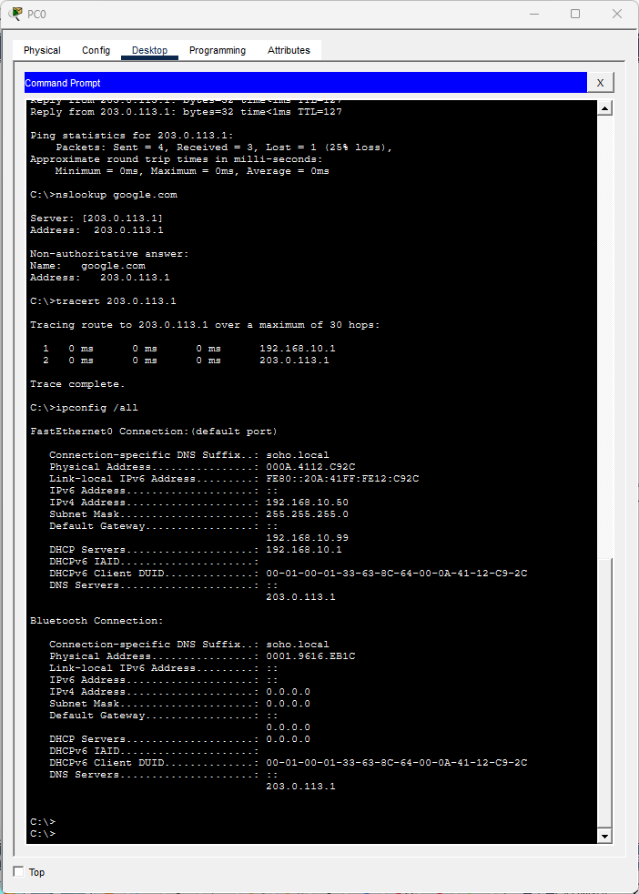

2. `ping 192.168.10.99` (the configured gateway) — all 4 packets time out. Confirms that address doesn't exist.

   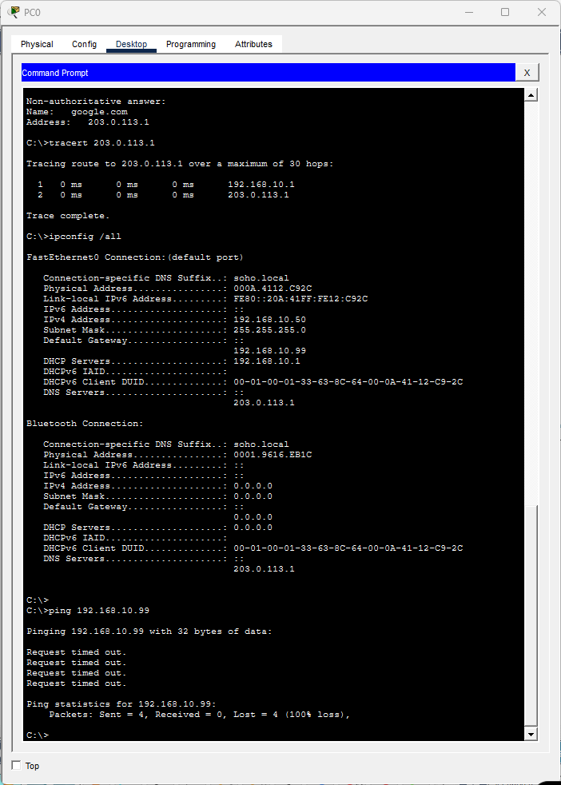

3. `ping 192.168.10.1` (the *real* gateway) — 4/4 replies. **This is the key diagnostic.** Even though the PC has the wrong default gateway configured, the real gateway is still pingable because it's on the same subnet — the PC can reach it via ARP at Layer 2 without consulting its (broken) default gateway.

   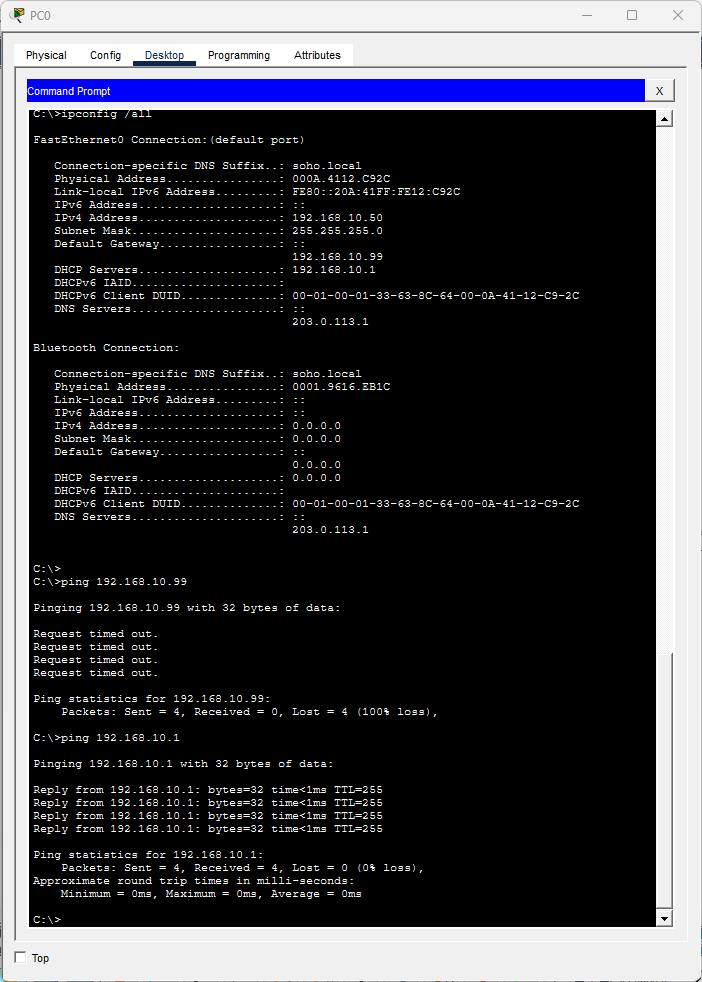

4. `ping 203.0.113.1` (off-subnet / "internet") — 4/4 timeouts. This is the ping that actually proves the impact of the misconfiguration: off-subnet traffic requires the default gateway, and the PC's default gateway doesn't exist.

   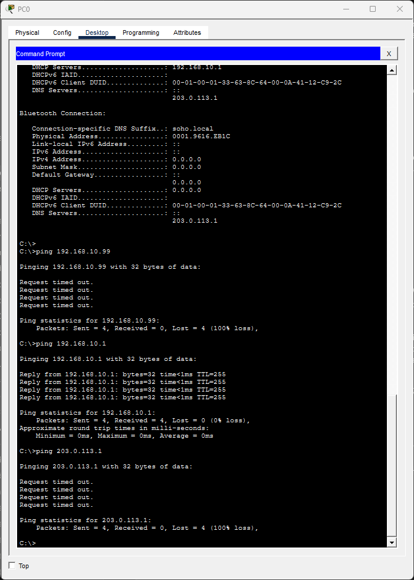

5. Compared PC0's IP configuration against a working neighbor's — neighbor's gateway is a real, reachable IP. PC0's is not.

   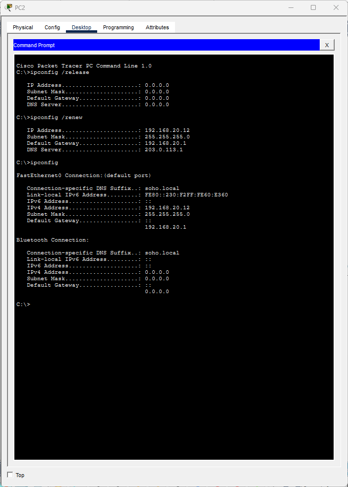

**Root cause:** PC0's default gateway was manually set to `192.168.10.99`, a non-existent address. Same-subnet traffic works because ARP bypasses the default gateway, but anything off-subnet — internet, cross-VLAN servers, printers in other VLANs — has no route out.

**Fix:** Reset IP Configuration to DHCP.

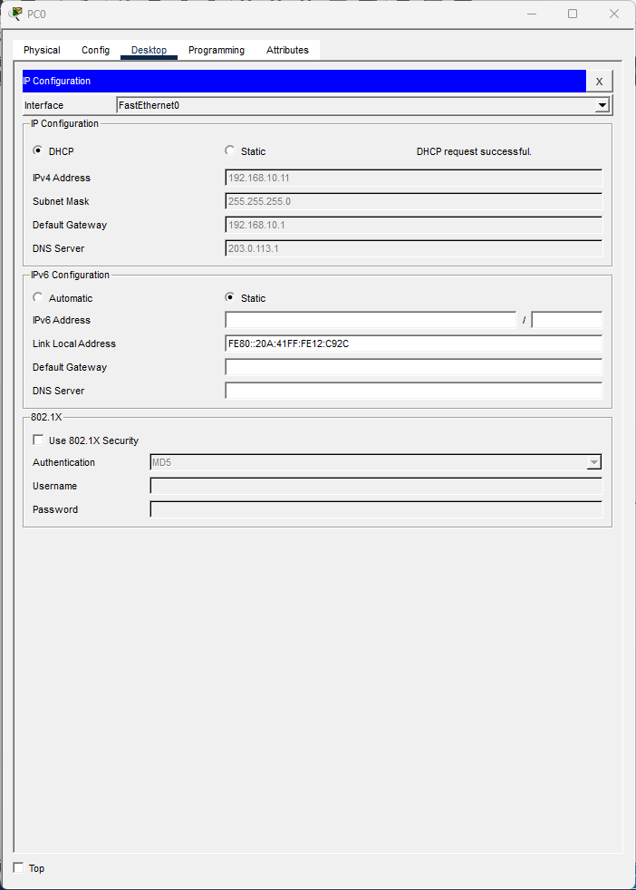

**Verification:** `ipconfig /all` shows Default Gateway now `192.168.10.1`; `ping 203.0.113.1` returns 4/4 replies.

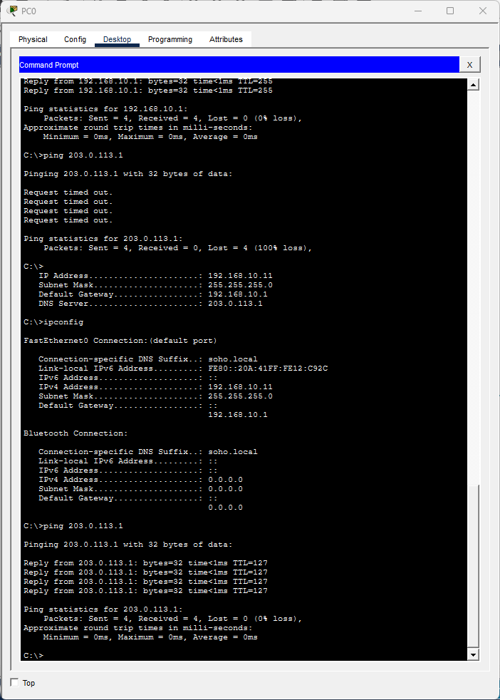

---

## T02 — "My PC got a weird 169 address and nothing works"

**Affected users:** PC1 and PC2 (both VLAN 20 Staff)
**Severity:** Sev-B (multiple users in one VLAN, business impact)

**Reported symptom:** *"My computer says 'limited connectivity' at the bottom of the screen, and my IP address starts with 169."*

**Clarifying questions:**
- Is anyone else in your area affected? (Yes — the coworker next to them has the same issue.) This immediately raises severity.

**Diagnosis:**

1. On PC1, `ipconfig /all` — all address fields show `0.0.0.0` after a failed DHCP renew. (In real Windows this would be an APIPA address `169.254.x.x`; Packet Tracer's simulation shows `0.0.0.0` instead. Both indicate the same underlying problem: no DHCP response received.)

   

2. `ipconfig /release` then `ipconfig /renew` on PC1 — renew times out with `DHCP request failed.`

   

3. **Ruling out a PC-specific issue:** repeat the release/renew on PC2 (same VLAN). PC2 also fails. Two PCs in the same VLAN failing DHCP → the problem is upstream, not on the PC.

   

4. On Router0, `show ip dhcp pool` — only `VLAN10-IT` and `VLAN30-GUEST` are listed. `VLAN20-STAFF` is missing entirely.

   

**Root cause:** The DHCP pool for VLAN 20 was removed from Router0's configuration. Without a pool, the router ignores DHCPDISCOVER broadcasts from VLAN 20 clients, and they fall into the no-lease state.

**Fix:** Recreate the pool on Router0.


**Verification:** PC1 renew succeeds with `192.168.20.11`; pings to gateway and external both succeed.


---

## T03 — "I can ping the server but websites won't load"

**Affected user:** PC2 (VLAN 20 Staff)
**Severity:** Sev-C

**Reported symptom:** *"Ping works when I use numbers but I can't open any websites. Every URL gives me 'could not find host.'"*

**Diagnosis:**

1. `ping 203.0.113.1` → 4/4 replies. Network path and routing are fine.

   

2. `ping google.com` → *"Ping request could not find host google.com."* **Name resolution specifically** is broken. This is the fingerprint of a DNS problem: Layer 1 through 4 work, Layer 7 (DNS) fails.

   

3. `nslookup google.com` → DNS request timed out. Confirms the configured DNS server is unreachable, not just slow.

   

4. `ipconfig /all` — DNS Server shows `10.10.10.10`, an IP that doesn't exist anywhere in this network.

   

**Root cause:** PC2's DNS server is statically set to `10.10.10.10`, which doesn't exist on our network. DNS queries are sent but never answered.

**Fix:** Reset IP Configuration to DHCP. Router0's DHCP pool pushes the correct DNS server (`203.0.113.1`).


**Verification:** `nslookup google.com` returns `203.0.113.1`; `ping google.com` returns 4/4 replies from that IP.


---

## T04 — "I can see the guest Wi-Fi but it won't let me connect"

**Affected user:** Laptop0 (contractor, VLAN 30 Guest)
**Severity:** Sev-C (single guest, no productivity impact)

**Reported symptom:** *"I can see 'SOHO-Guest' on my laptop and I'm typing in the password from the guest card. It just says 'failed to connect' or keeps trying forever. Did you change the password?"*

**Diagnosis:**

1. On Laptop0, PC Wireless → Connect tab → Refresh. The `SOHO-Guest` SSID **is visible**. This is the key differentiator from T07 (where the SSID itself was missing) — the AP is broadcasting correctly, so the problem is downstream of discovery.

   

2. Attempt to connect with the documented passphrase (`GuestPass123`). Packet Tracer's wireless simulation fails silently — no error dialog. But the association never completes, as confirmed by:

   

3. `ipconfig /all` on Laptop0's wireless interface — all fields `0.0.0.0`. No DHCP lease means no successful association.

   

4. On Access Point0, Config → Port 1 → PSK Pass Phrase field shows `WrongPass456` instead of the documented `GuestPass123`.

   

**Root cause:** Access Point0's WPA2 pre-shared key was changed from the documented value. Users with the old (correct) key can no longer authenticate.

**Fix:** Restore PSK to `GuestPass123` on the AP.


**Verification:** Laptop0 associates successfully, pulls DHCP lease on VLAN 30, pings external.


> **Note on differentiating wireless tickets:** T04 and T07 look similar on the surface (both are "I can't get on Wi-Fi"), but the first diagnostic step distinguishes them cleanly. **SSID visible but won't authenticate → check the AP's PSK / auth config (T04).** **SSID not visible at all → check the AP's SSID broadcast (T07).** Asking one question up front saves a lot of time.

---

## T05 — "The new hire's PC won't connect to anything"

**Affected user:** PC2 (VLAN 20 Staff — new hire)
**Severity:** Sev-C

**Reported symptom (from IT):** *"I just set up the new intern at the desk by the window. Their PC has link lights but can't get online. Everyone else in the cubicle row is fine."*

**Diagnosis:**

1. `ipconfig /all` on PC2 — all fields `0.0.0.0`. No DHCP lease.

   

2. Physical check — green link lights on both ends of PC2's cable. Layer 1 and 2 between PC and switch are fine.

   

3. **Key insight:** green link + no DHCP on a single PC (while neighbors work) = most likely a switchport VLAN problem, not a DHCP or cable issue. Contrast with T02, where *multiple* PCs failed DHCP in the same VLAN — that pointed at the pool. Here, only one PC, so check the port.

4. On Switch0, `show interfaces FastEthernet0/6 switchport` — Access Mode VLAN is `99`, not the expected `20`.

   

5. `show vlan brief` — VLAN 99 either doesn't exist in the database or exists only as Fa0/6's lonely member. Not part of the network's design.

   

**Root cause:** Switchport Fa0/6 was misassigned to VLAN 99 — a VLAN with no DHCP pool, no router sub-interface, and no trunk membership. The PC is alive on the wire but stranded.

**Fix:** Reassign Fa0/6 to VLAN 20.


**Verification:** `show interfaces Fa0/6 switchport` now shows VLAN 20; PC2 renews DHCP and pings succeed.


---

## T06 — "Printer is offline — nobody can print"

**Affected device:** Printer0 (VLAN 20)
**Severity:** Sev-B (entire office impacted)

**Reported symptom:** *"The whole office is complaining. Print jobs are just sitting in the queue. Even the printer's web page won't load."*

**Diagnosis:**

1. From PC1, `ping 192.168.20.10` — all 4 packets time out. Printer unreachable at Layer 3.

   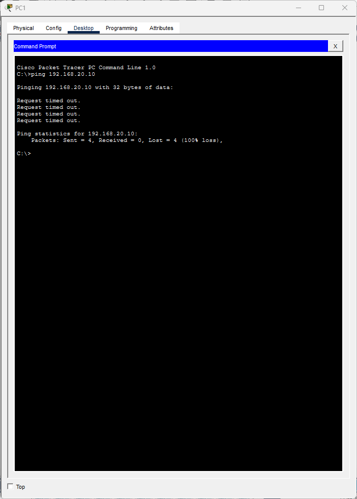

2. In the Logical workspace, the cable between Switch0 and Printer0 shows a **red** link indicator. Physical / link layer is down.

   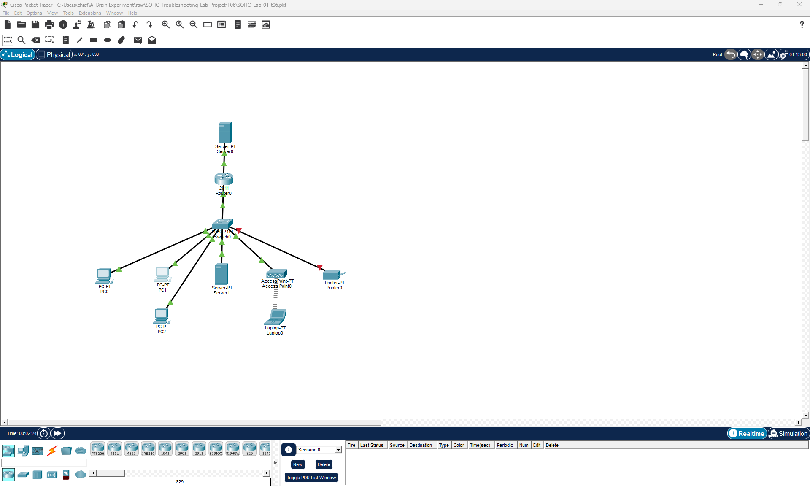

3. On Switch0, `show interfaces FastEthernet0/20` — first line reads *"administratively down, line protocol is down."* The phrase **"administratively down"** is the signature of a deliberate `shutdown` command, not a broken cable or powered-off device.

   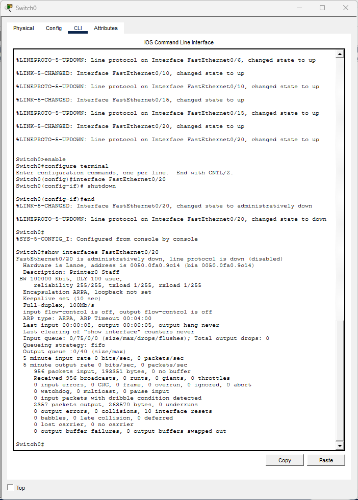

**Root cause:** Switch0's Fa0/20 was left administratively shut down after maintenance — the printer itself is healthy, it's just been cut off at the switch.

**Fix:** `no shutdown` on Fa0/20.

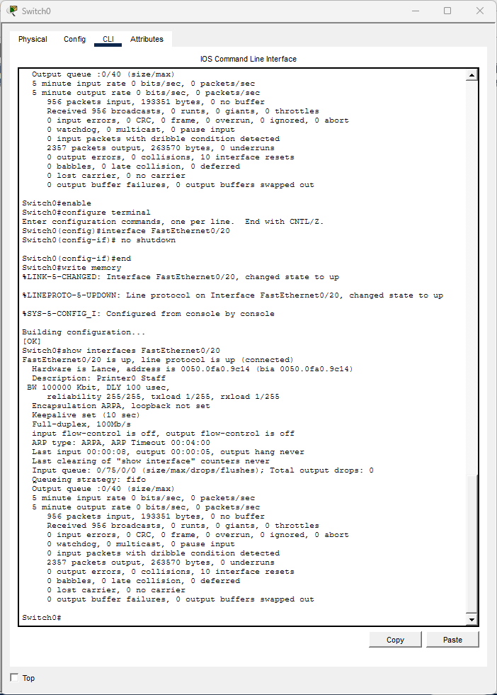

**Verification:** Link indicator turns green; ping to printer succeeds.


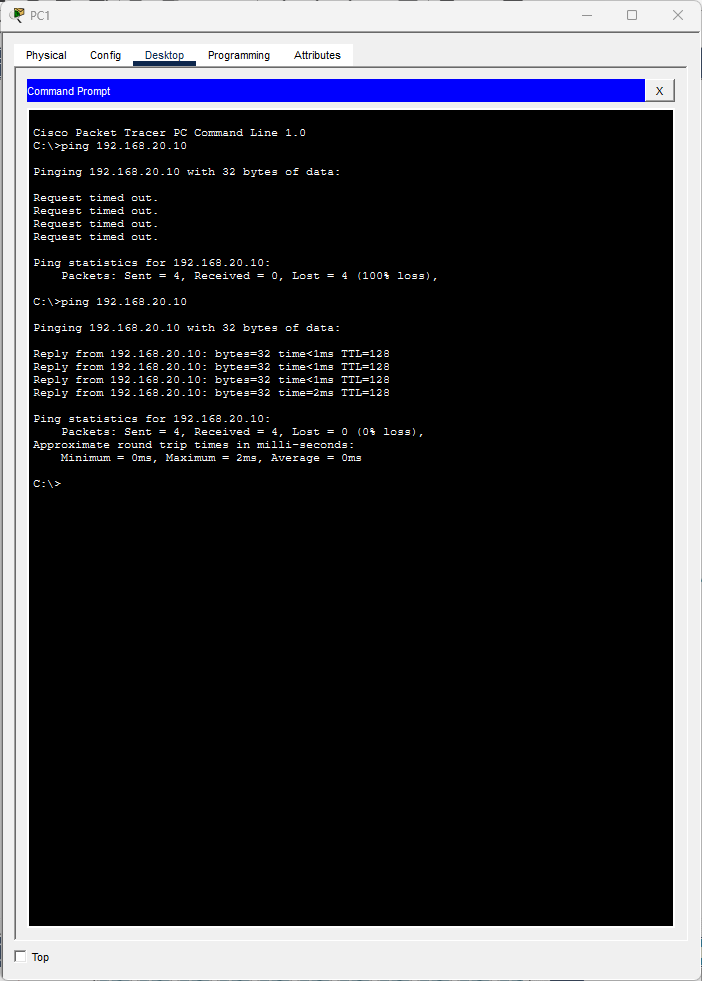

---

## T07 — "I can't get on the guest Wi-Fi"

**Affected user:** Visiting contractor (Laptop0)
**Severity:** Sev-C

**Reported symptom:** *"Your Wi-Fi name isn't showing up on my laptop. I see 'SOHO-Guest-TEMP' but nothing called 'SOHO-Guest' like the guest card said."*

**Diagnosis:**

1. On Laptop0, PC Wireless → Connect → Refresh. Only `SOHO-Guest-TEMP` appears. The documented SSID `SOHO-Guest` is absent.

   

2. On Access Point0, Config → Port 1 → SSID field shows `SOHO-Guest-TEMP`.

   

**Root cause:** Access Point0's broadcast SSID was changed from `SOHO-Guest` to `SOHO-Guest-TEMP` without updating the documented guest-card information.

**Fix:** Restore SSID to `SOHO-Guest` on the AP.


**Verification:** Laptop sees `SOHO-Guest`, connects with the documented passphrase, obtains DHCP, pings external.


---

## T08 — "We can reach internal stuff but can't get to the internet"

**Affected users:** All clients (full network)
**Severity:** Sev-A (total external outage)

**Reported symptom:** *"Shared drive works, internal sites work, but nobody can reach anything external. Our ping tests to 203.0.113.1 just time out."*

**Diagnosis:**

1. From PC0, `ping 192.168.20.10` (Printer0, cross-VLAN internal) — 4/4 replies. Internal routing is intact. Rules out a total network outage.

   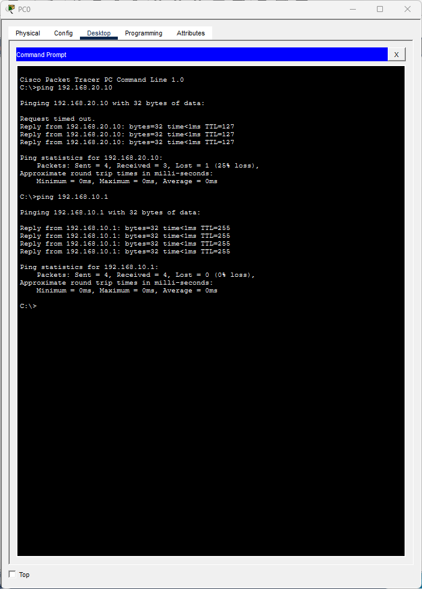

2. `ping 203.0.113.1` — 4/4 timeouts. External is specifically broken.

   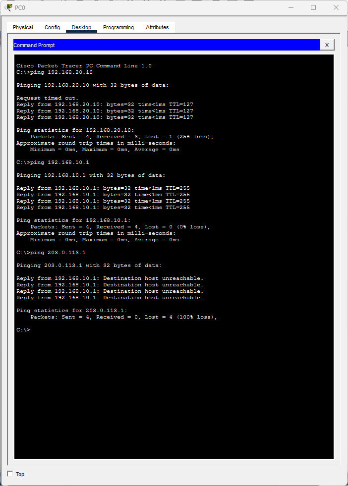

3. `tracert 203.0.113.1` — reaches `192.168.10.1` (Router0) on hop 1, then dies. **Tracert dying at the edge router means the problem is *on* the router** — not the LAN, not the PC.

   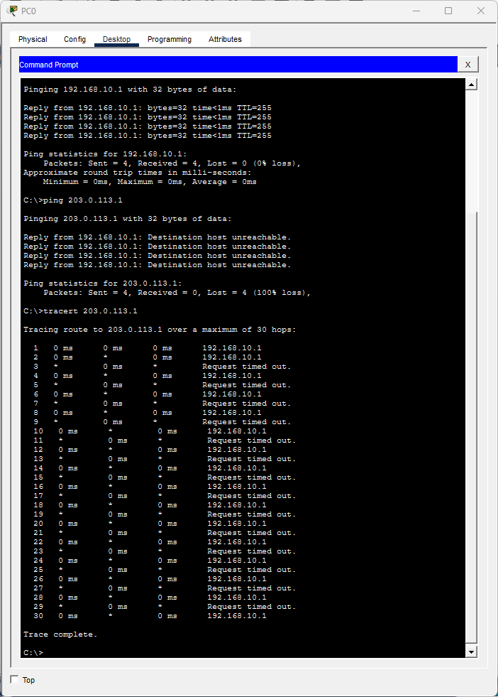

4. On Router0, `show ip interface brief` — `GigabitEthernet0/1` (the WAN uplink) is **administratively down**. All internal sub-interfaces are up.

   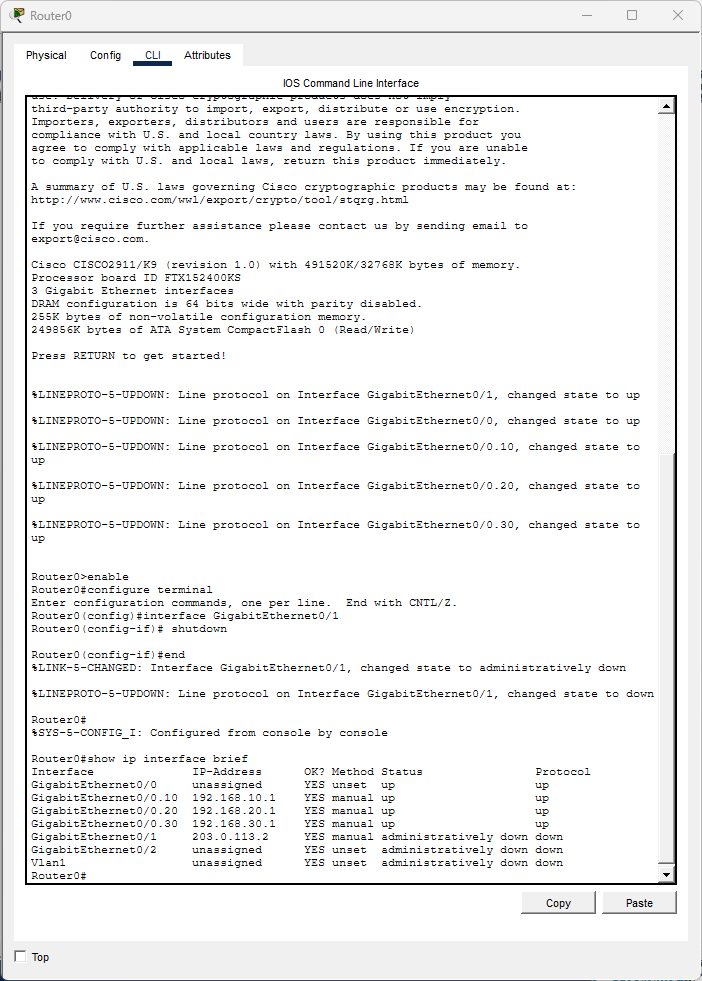

5. `show ip route` — no `C  203.0.113.0/30` connected route (because Gi0/1 is down), and no `S*  0.0.0.0/0` default route (the static default's next-hop is unreachable, so the routing table drops it).

   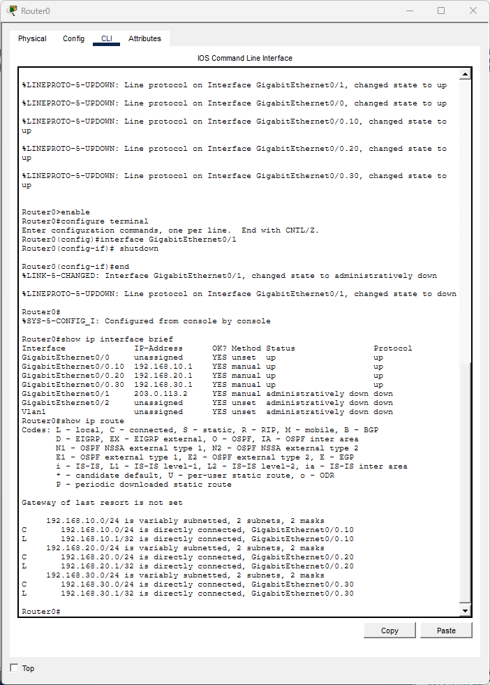

**Root cause:** Router0's WAN interface was left administratively shut down after maintenance. The connected route to `203.0.113.0/30` disappeared from the routing table, which in turn invalidated the default route. Internal traffic still worked because it uses the Gi0/0 sub-interfaces (still up), but anything destined outside the internal VLANs had no route.

**Fix:** `no shutdown` on Gi0/1.

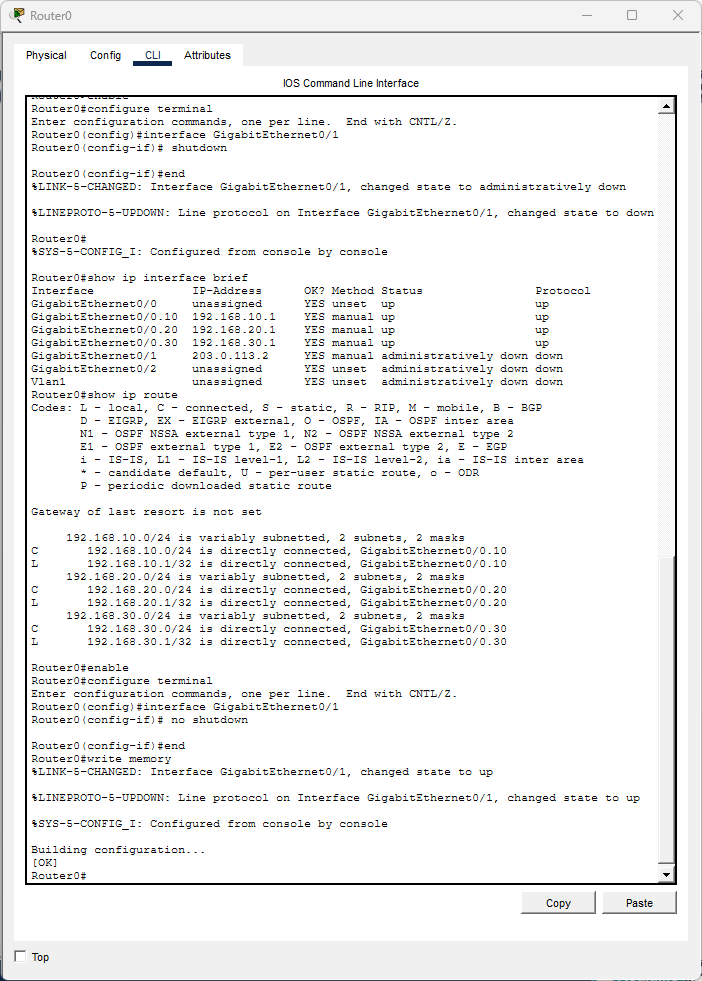

**Verification:** Routing table now includes the connected `203.0.113.0/30` and the default route `S*  0.0.0.0/0 via 203.0.113.1`. PC0 pings external successfully; tracert completes in 2 hops.

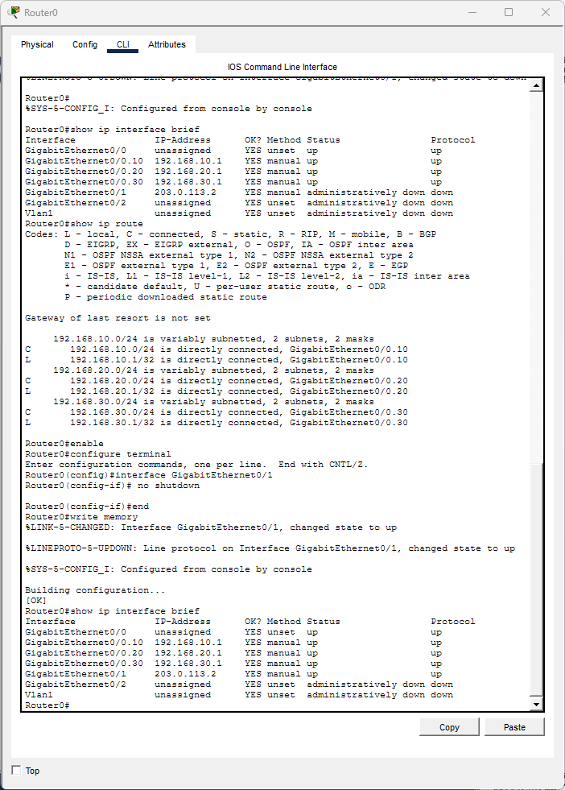

---

## Tool-awareness notes (things I learned while building this)

Packet Tracer is a simulator, and some behaviors differ from real-world Windows / Cisco IOS. Three genuine discoveries from this project that I'd flag to a teammate:

1. **PT shows `0.0.0.0`, not APIPA, when DHCP fails.** Real Windows falls back to a `169.254.x.x` APIPA address; Packet Tracer just leaves everything at `0.0.0.0` with repeated `DHCP request failed.` messages. Same underlying state, different surface presentation — worth knowing if you're moving between the simulator and real help desk tickets.

2. **Cisco routers have Proxy ARP enabled by default**, which silently "fixes" some client-side misconfigurations that should otherwise fail. I originally planned a wrong-subnet-mask ticket where a client misjudges which IPs are local — in theory it should break cross-VLAN pings, but Proxy ARP steps in, responds to the client's ARP on behalf of the remote host, and the ping works anyway. I redesigned that ticket rather than disable Proxy ARP network-wide.

3. **Packet Tracer blocks duplicate-IP static configurations at input time**, displaying *"This address is already used in the network"* and refusing the value. This mimics how some modern OS stacks do ARP-probe before committing a static IP, but it means the classic "two devices with the same IP" ticket can't be reproduced the traditional way in PT. I swapped that scenario for a WPA2 authentication failure instead.

These adaptations aren't shortcomings of the lab — they're signals that I hit real tooling constraints and adjusted rather than giving up on a broken approach.

---

## Running this lab yourself

1. Install **Cisco Packet Tracer** (free via Cisco NetAcad) version 8.x or newer.
2. Clone this repo: `git clone https://github.com/zackaryr1/packet-tracer-soho-lab.git`
3. Open `packet-tracer-files/SOHO-Lab-01-Build.pkt` for the known-good working state (all DHCP, DNS, VLANs, and inter-VLAN routing fully configured).
4. Open any `SOHO-Lab-01-t0X.pkt` to load the broken state for the corresponding ticket (`t01` = Ticket #T01, etc.), then walk through the diagnosis and apply the fix documented above.

All tickets are reproducible end-to-end in under 5 minutes each.

---

## Repository contents

```
packet-tracer-soho-lab/
├── README.md                                       (this file)
├── packet-tracer-files/
│   ├── SOHO-Lab-01-Build.pkt                       known-good working topology
│   ├── SOHO-Lab-01-t01.pkt                         broken state for T01 (wrong default gateway)
│   ├── SOHO-Lab-01-t02.pkt                         broken state for T02 (DHCP pool missing)
│   ├── SOHO-Lab-01-t03.pkt                         broken state for T03 (bad DNS on client)
│   ├── SOHO-Lab-01-t04.pkt                         broken state for T04 (wrong Wi-Fi PSK)
│   ├── SOHO-Lab-01-t05.pkt                         broken state for T05 (wrong VLAN on port)
│   ├── SOHO-Lab-01-t06.pkt                         broken state for T06 (switchport shutdown)
│   ├── SOHO-Lab-01-t07.pkt                         broken state for T07 (wrong SSID)
│   └── SOHO-Lab-01-t08.pkt                         broken state for T08 (WAN interface down)
└── screenshots/
    ├── 01-build-*.png through 12-baseline-*.png    environment buildout evidence
    └── t01-*.png through t08-*.png                 per-ticket diagnostic evidence
```

---

## About this portfolio

I'm [Zackary Ramcharam](https://linkedin.com/in/zackary-ramcharam), a UCF Information Technology student actively job-hunting for IT help desk, service desk, and desktop support roles. My other labs:

- [active-directory-aws-lab](https://github.com/zackaryr1/active-directory-aws-lab) — cloud-based Active Directory domain environment
- [osticket-azure-lab](https://github.com/zackaryr1/osticket-azure-lab) — production-style IT help desk on Azure

Reach me at **zramcharam@gmail.com** or via [LinkedIn](https://linkedin.com/in/zackary-ramcharam).
