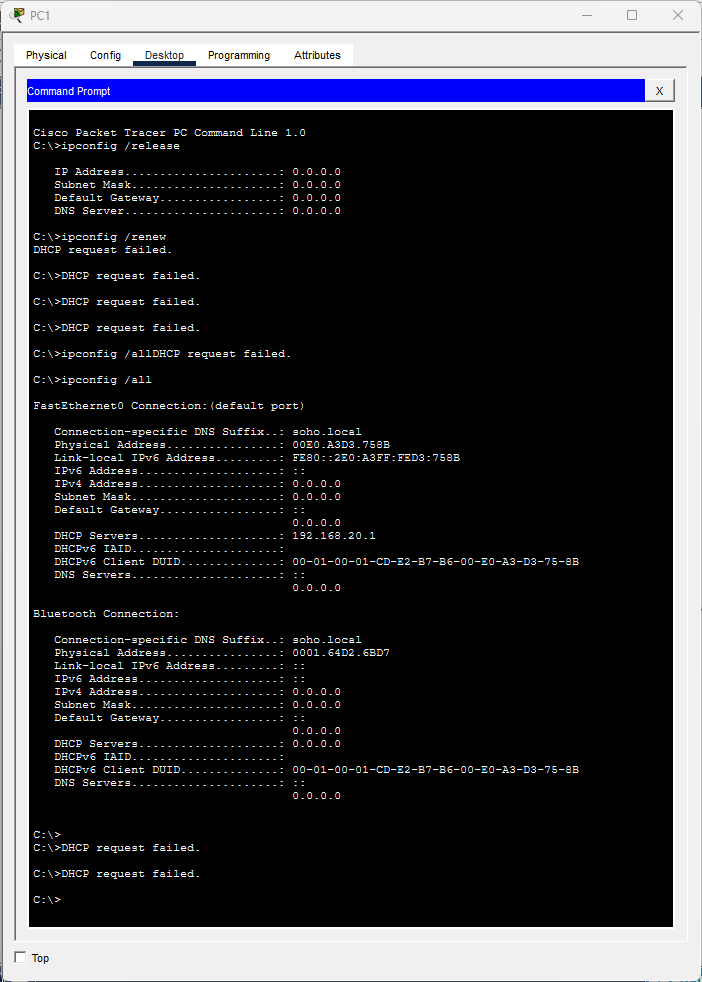
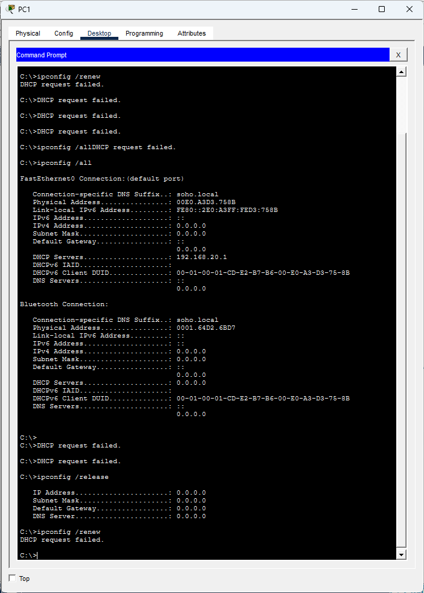
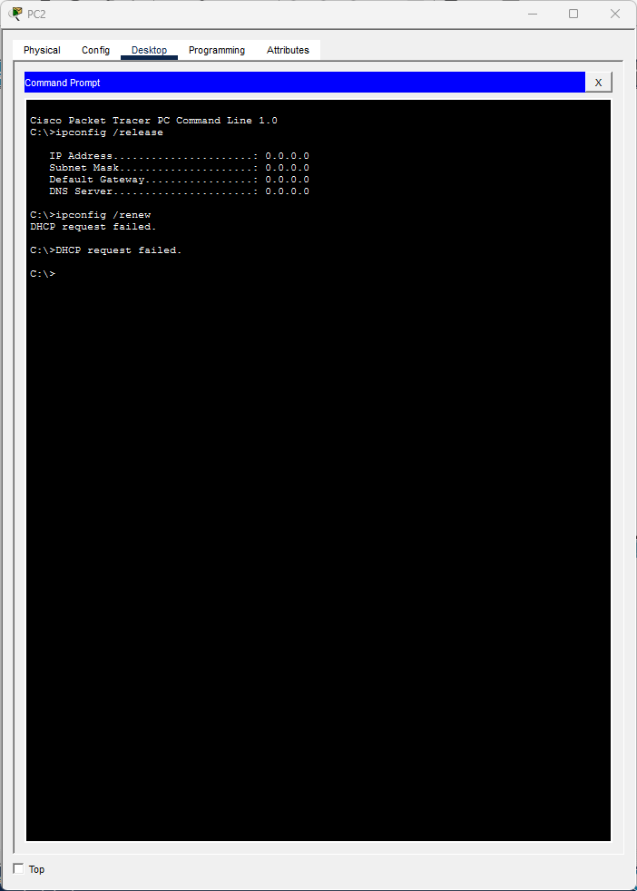
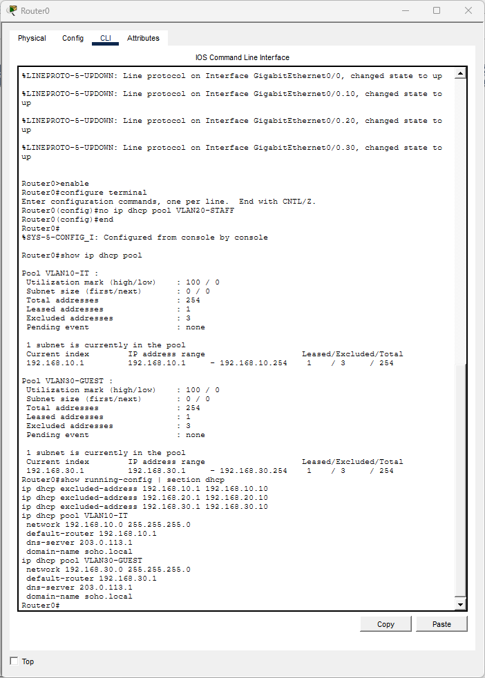
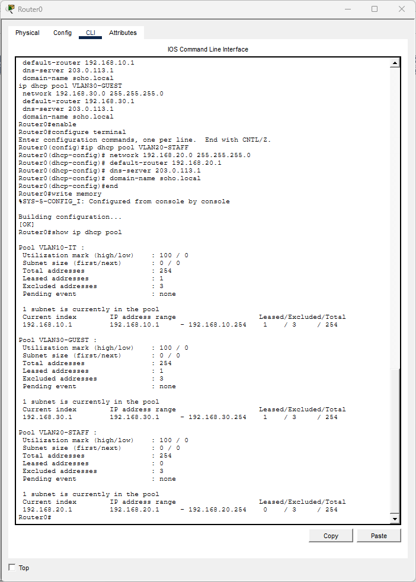
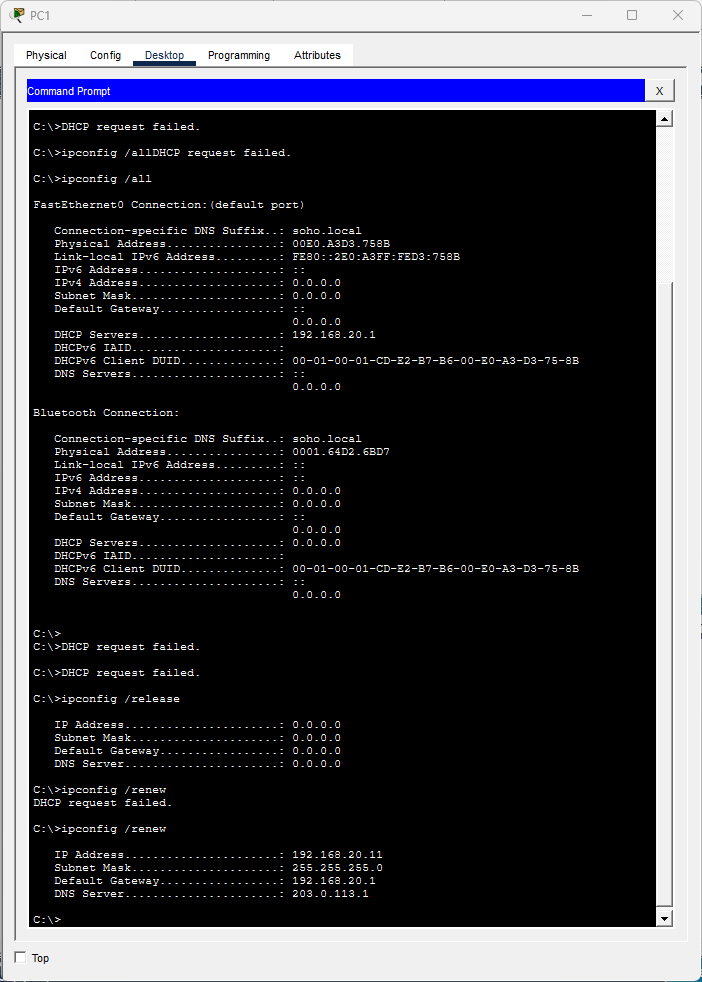
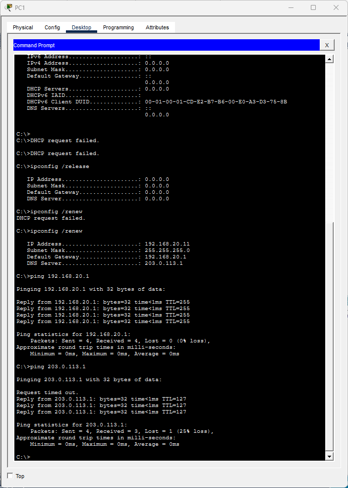

# Ticket #T02: "My PC got a weird 169 address and nothing works"

**[← Back to lab overview](../README.md)**

**Affected users:** PC1 and PC2 (both VLAN 20 Staff)
**Severity:** Sev-B (multiple users in one VLAN, business impact)
**Packet Tracer file:** [`packet-tracer-files/SOHO-Lab-01-t02.pkt`](../packet-tracer-files/SOHO-Lab-01-t02.pkt)

---

## Reported symptom

> *"My computer says 'limited connectivity' at the bottom of the screen, and my IP address starts with 169."*

## Clarifying questions I asked

- Is anyone else in your area affected? (Yes, the coworker next to them has the same issue.) This immediately raises severity.

## Diagnosis

### 1. `ipconfig /all` on PC1: confirm the reported 169 address

In Packet Tracer's simulation, all address fields show `0.0.0.0` after a failed DHCP renew. (In real Windows this would be an APIPA address `169.254.x.x`; PT shows `0.0.0.0` instead. Both indicate the same underlying problem: no DHCP response received.)



### 2. `ipconfig /release` then `ipconfig /renew`: try to re-acquire

Renew times out with `DHCP request failed.`



### 3. Rule out a PC-specific issue: test PC2 (same VLAN)

PC2 also fails release/renew with the same `DHCP request failed.` output. Two PCs in the same VLAN failing DHCP → the problem is upstream, not on the PCs themselves.



### 4. Check Router0's DHCP pool configuration

On Router0, `show ip dhcp pool` shows only `VLAN10-IT` and `VLAN30-GUEST`. `VLAN20-STAFF` is missing entirely.



## Root cause

The DHCP pool for VLAN 20 was removed from Router0's configuration. Without a pool, the router ignores DHCPDISCOVER broadcasts from VLAN 20 clients, and they fall into the no-lease state.

## Fix

Recreate the pool on Router0:

```
enable
configure terminal
ip dhcp pool VLAN20-STAFF
 network 192.168.20.0 255.255.255.0
 default-router 192.168.20.1
 dns-server 203.0.113.1
 domain-name soho.local
end
write memory
```



## Verification

PC1 renew succeeds with `192.168.20.11`; pings to gateway and external both succeed.




---

**[← Back to lab overview](../README.md)**
