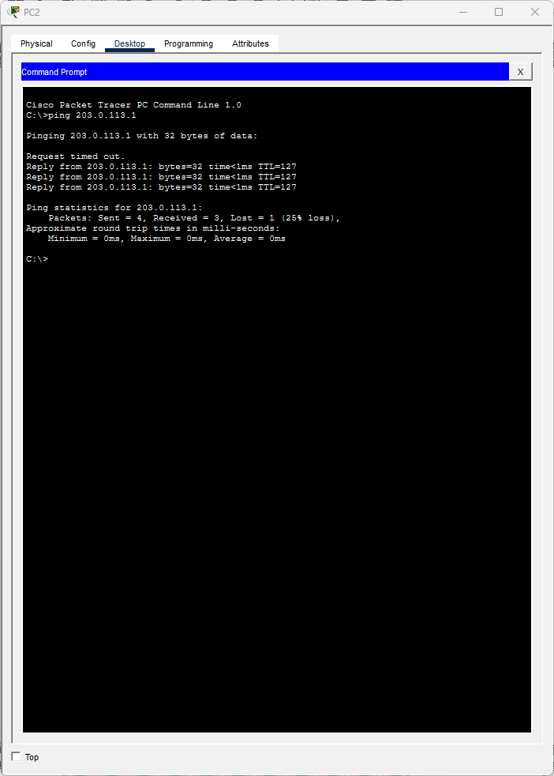
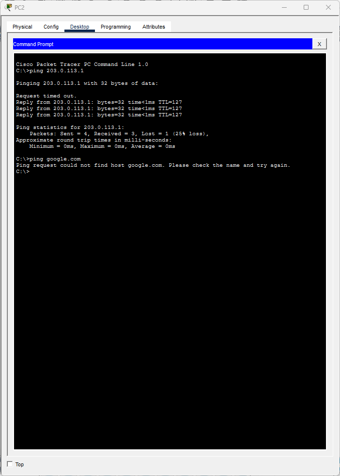
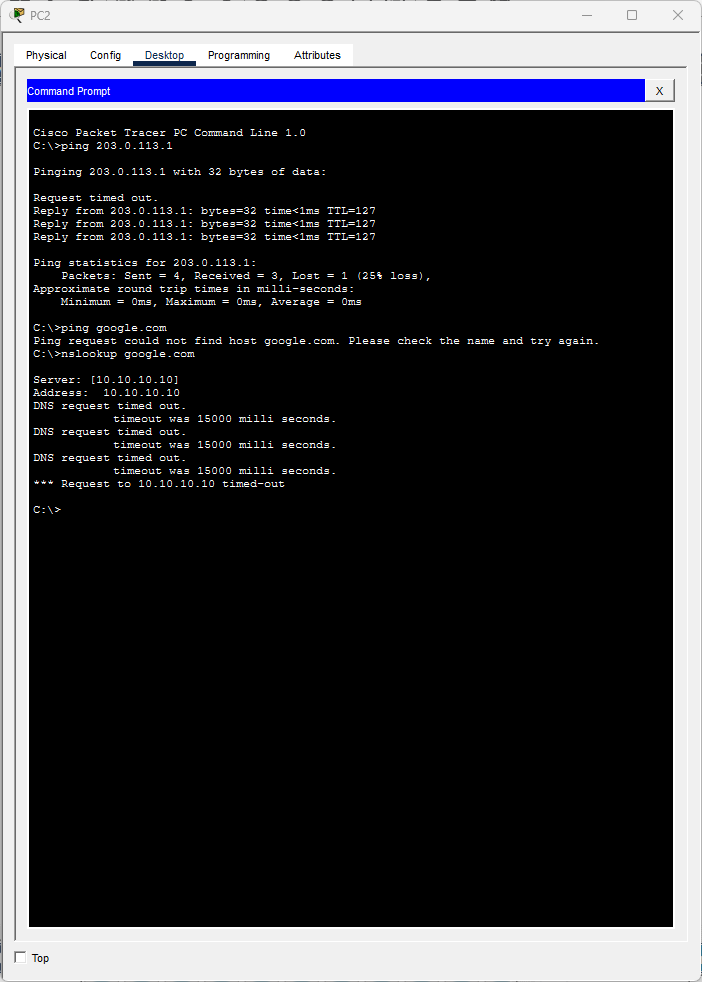
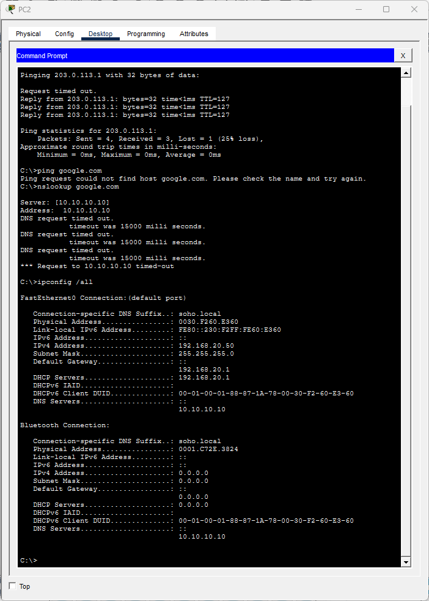
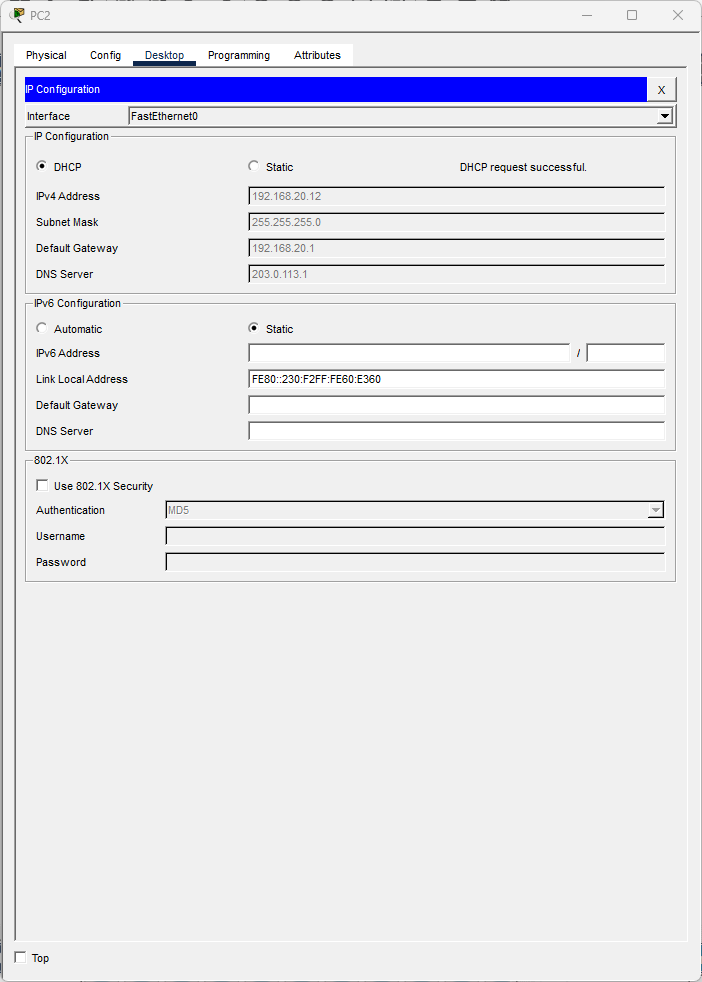
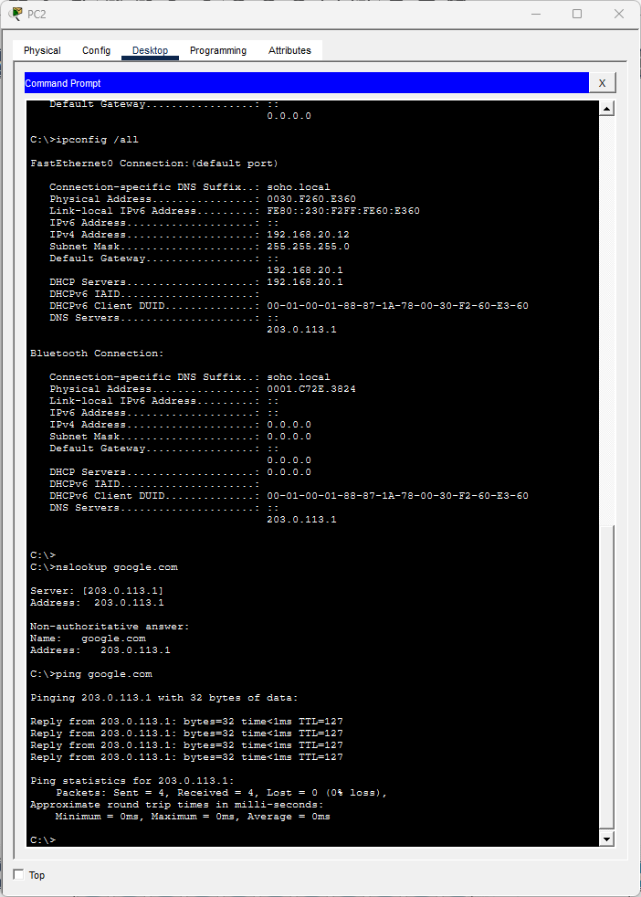

# Ticket #T03: "I can ping the server but websites won't load"

**[← Back to lab overview](../README.md)**

**Affected user:** PC2 (VLAN 20 Staff)
**Severity:** Sev-C
**Packet Tracer file:** [`packet-tracer-files/SOHO-Lab-01-t03.pkt`](../packet-tracer-files/SOHO-Lab-01-t03.pkt)

---

## Reported symptom

> *"Ping works when I use numbers but I can't open any websites. Every URL gives me 'could not find host.'"*

## Diagnosis

### 1. `ping 203.0.113.1`: test IP-layer reachability

4/4 replies. Network path and routing are fine.

### 2. `ping google.com`: test name resolution

*"Ping request could not find host google.com."* **Name resolution specifically** is broken. This is the fingerprint of a DNS problem: Layer 1 through 4 work, Layer 7 (DNS) fails.

### 3. `nslookup google.com`: confirm DNS server is unreachable

DNS request times out. Confirms the configured DNS server is unreachable, not just slow.

### 4. `ipconfig /all`: check the configured DNS server

DNS Server shows `10.10.10.10`, an IP that doesn't exist anywhere in this network.

## Root cause

PC2's DNS server is statically set to `10.10.10.10`, which doesn't exist on our network. DNS queries are sent but never answered.

## Fix

Reset IP Configuration to DHCP. Router0's DHCP pool pushes the correct DNS server (`203.0.113.1`).

## Verification

`nslookup google.com` returns `203.0.113.1`; `ping google.com` returns 4/4 replies from that IP.

---

**[← Back to lab overview](../README.md)**
