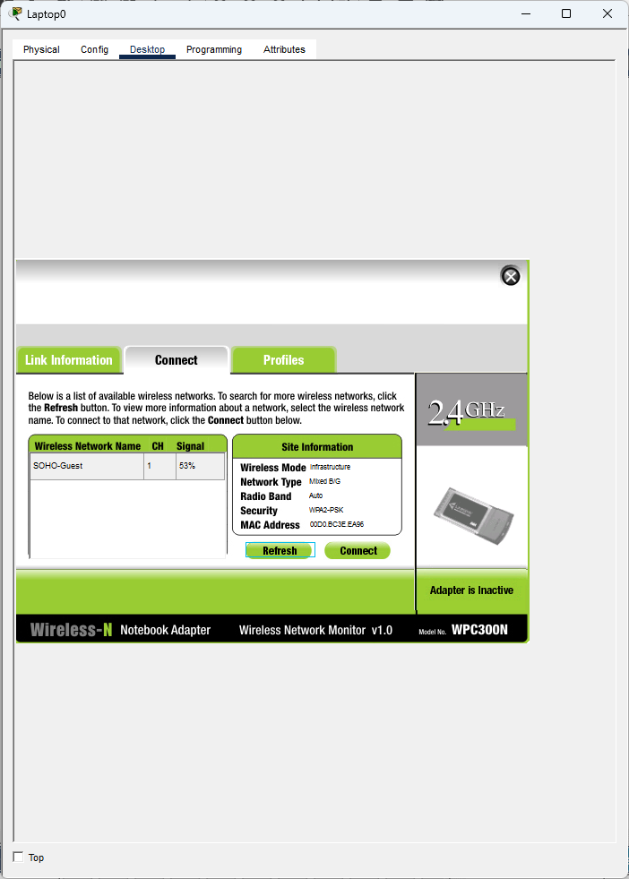
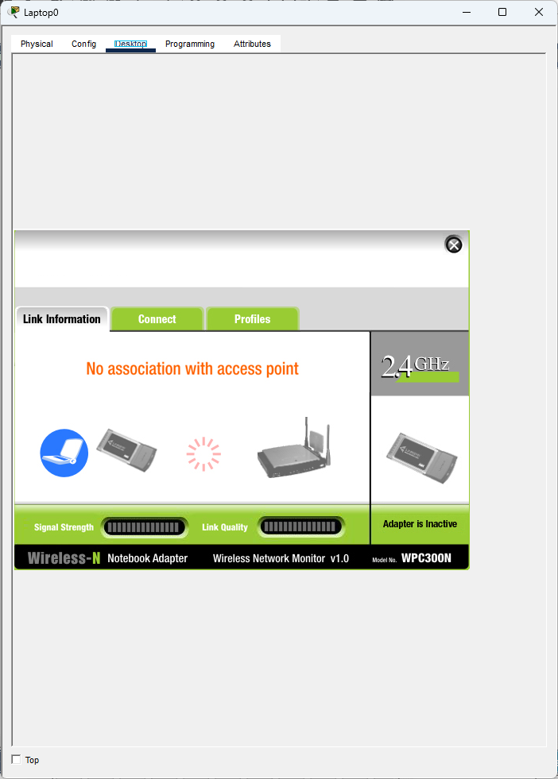
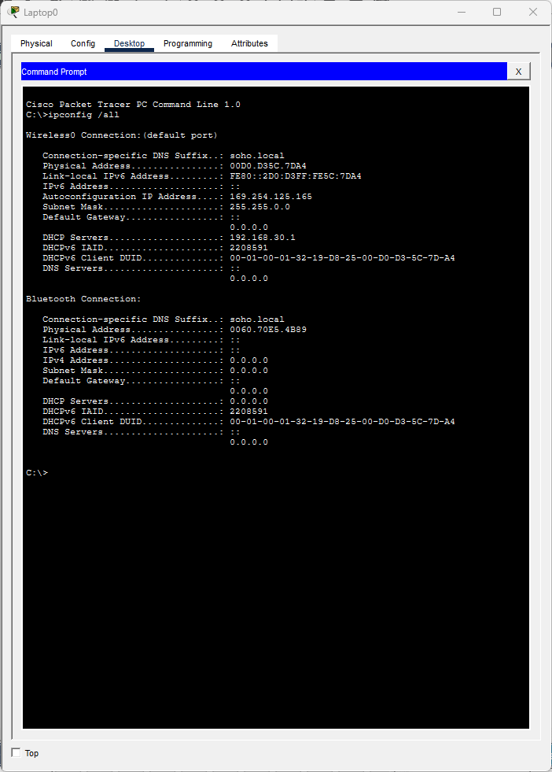
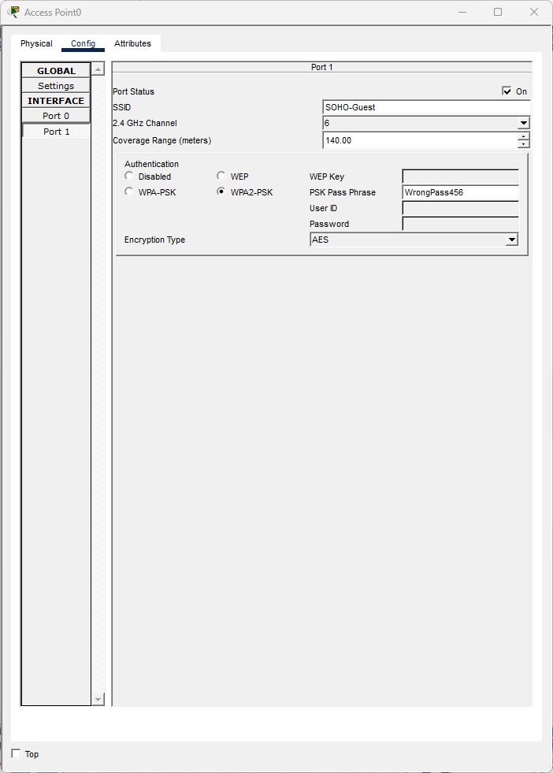
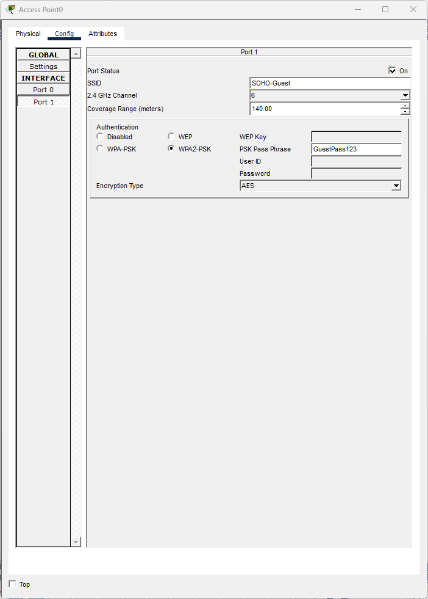
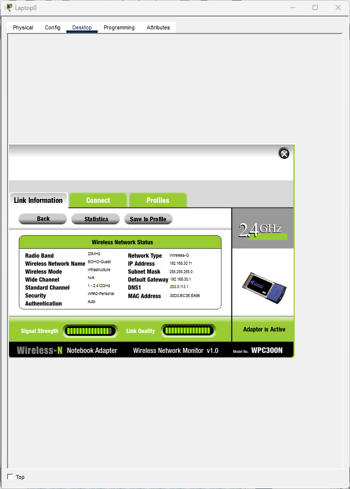
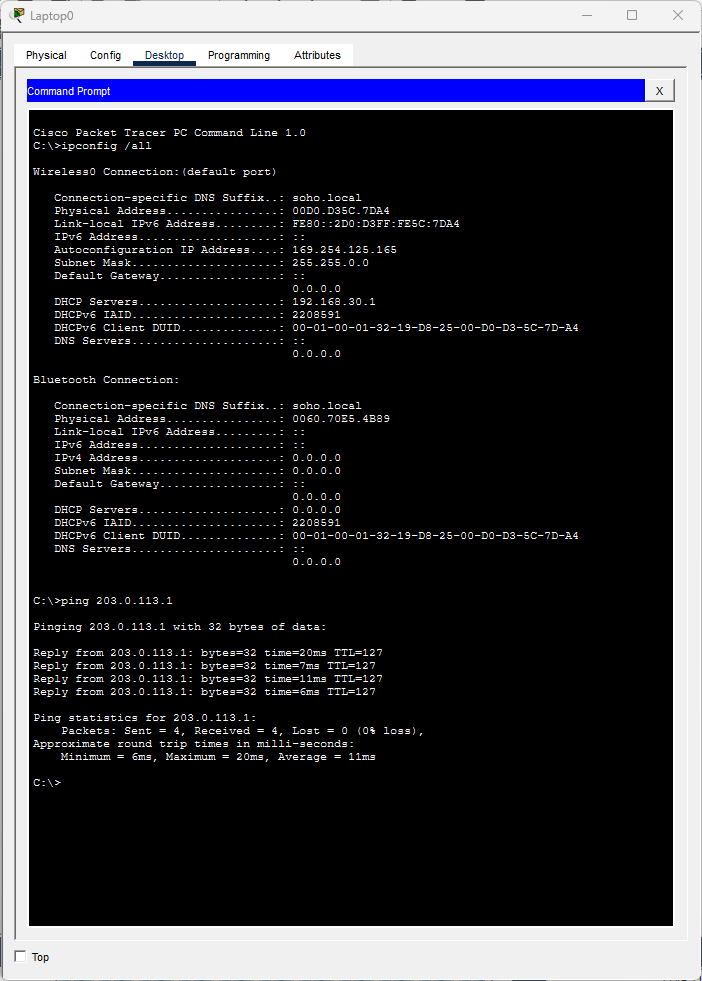

# Ticket #T04: "I can see the guest Wi-Fi but it won't let me connect"

**[← Back to lab overview](../README.md)**

**Affected user:** Laptop0 (contractor, VLAN 30 Guest)
**Severity:** Sev-C (single guest, no productivity impact)
**Packet Tracer file:** [`packet-tracer-files/SOHO-Lab-01-t04.pkt`](../packet-tracer-files/SOHO-Lab-01-t04.pkt)

---

## Reported symptom

> *"I can see 'SOHO-Guest' on my laptop and I'm typing in the password from the guest card. It just says 'failed to connect' or keeps trying forever. Did you change the password?"*

## Diagnosis

### 1. Scan for available networks

On Laptop0, PC Wireless → Connect tab → Refresh. The `SOHO-Guest` SSID is visible. This is the key differentiator from [T07](T07-wrong-ssid.md) (where the SSID itself was missing): the AP is broadcasting correctly, so the problem is downstream of discovery.

### 2. Attempt to associate with the documented passphrase

Entered `GuestPass123` (the documented, correct passphrase). Packet Tracer's wireless simulation fails silently: no error dialog, no popup. The association simply never completes.

### 3. Confirm the silent failure via `ipconfig /all`

Laptop0's wireless interface shows `0.0.0.0` across all fields. No DHCP lease = no successful association.

### 4. Inspect the AP's authentication config

On Access Point0, Config → Port 1 → PSK Pass Phrase field shows `WrongPass456` instead of the documented `GuestPass123`.

## Root cause

Access Point0's WPA2 pre-shared key was changed from the documented value. Users with the old (correct) key can no longer authenticate.

## Fix

Restore PSK to `GuestPass123` on the AP.

## Verification

Laptop0 associates successfully, pulls DHCP lease on VLAN 30, pings external.

---

## Note on differentiating wireless tickets

This ticket and [T07](T07-wrong-ssid.md) look similar on the surface. Both are "I can't get on Wi-Fi." The first diagnostic step distinguishes them cleanly:

- **SSID visible but won't authenticate** → check the AP's PSK / auth config (this ticket, T04).
- **SSID not visible at all** → check the AP's SSID broadcast ([T07](T07-wrong-ssid.md)).

Asking one question up front saves a lot of time.

---

**[← Back to lab overview](../README.md)**
