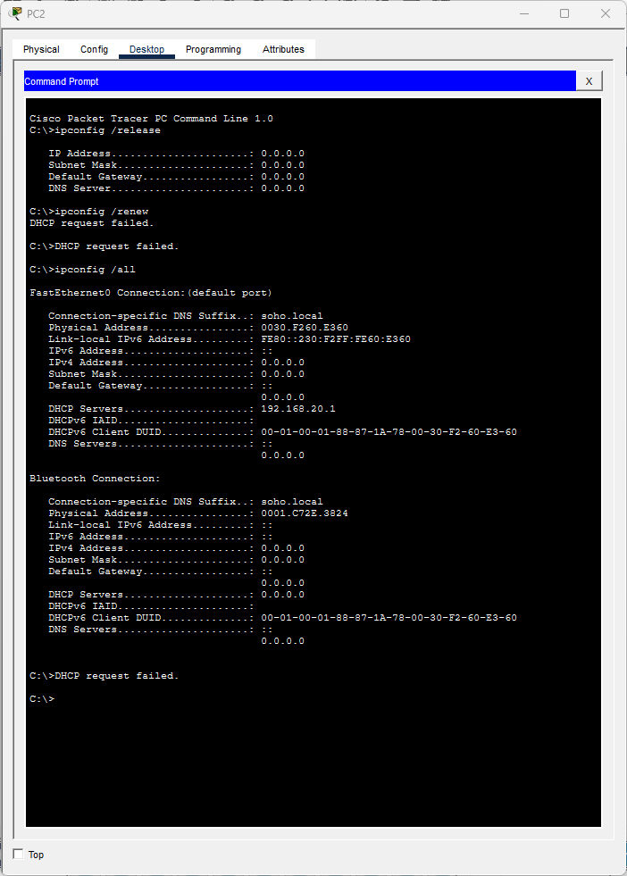
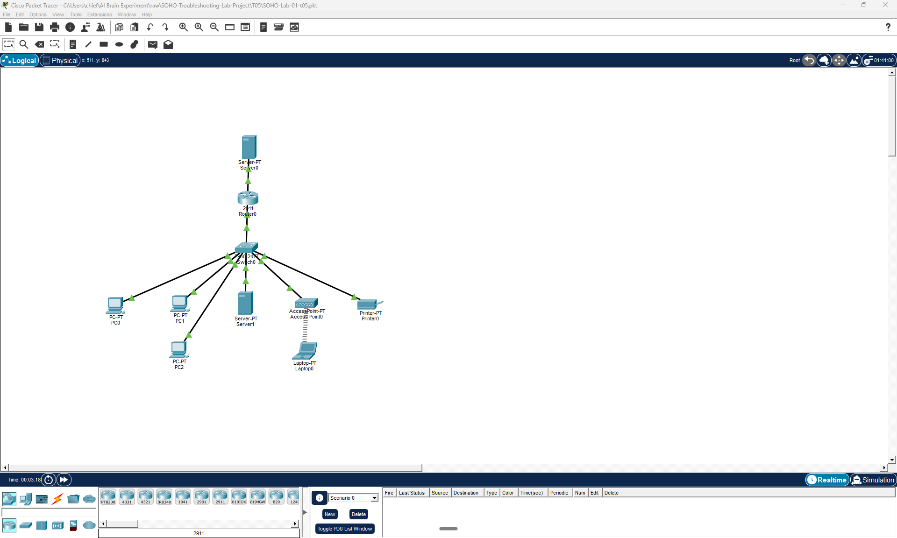
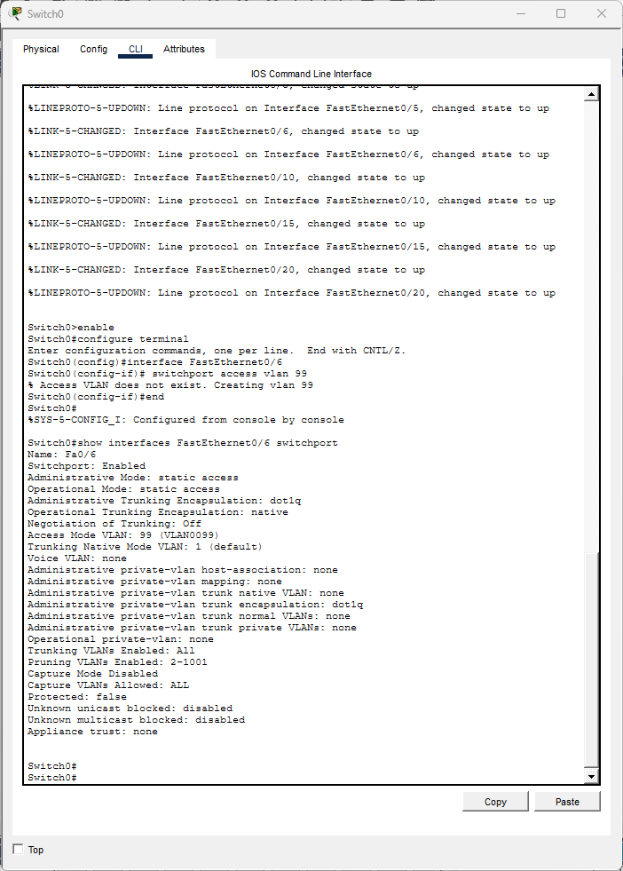
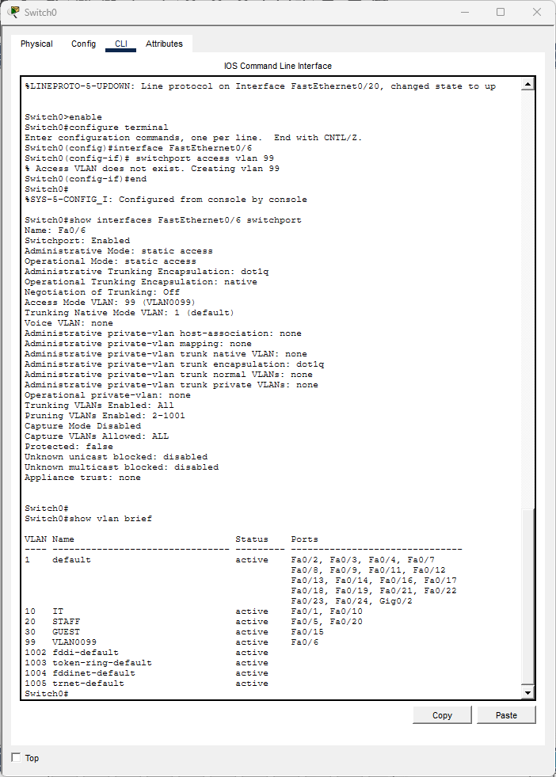
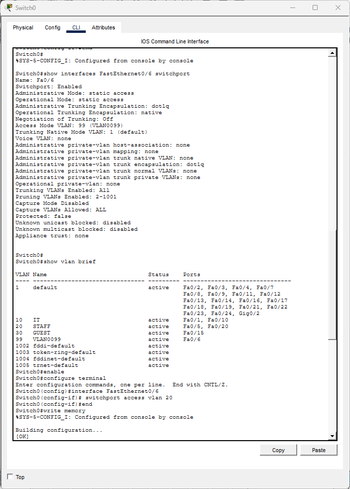
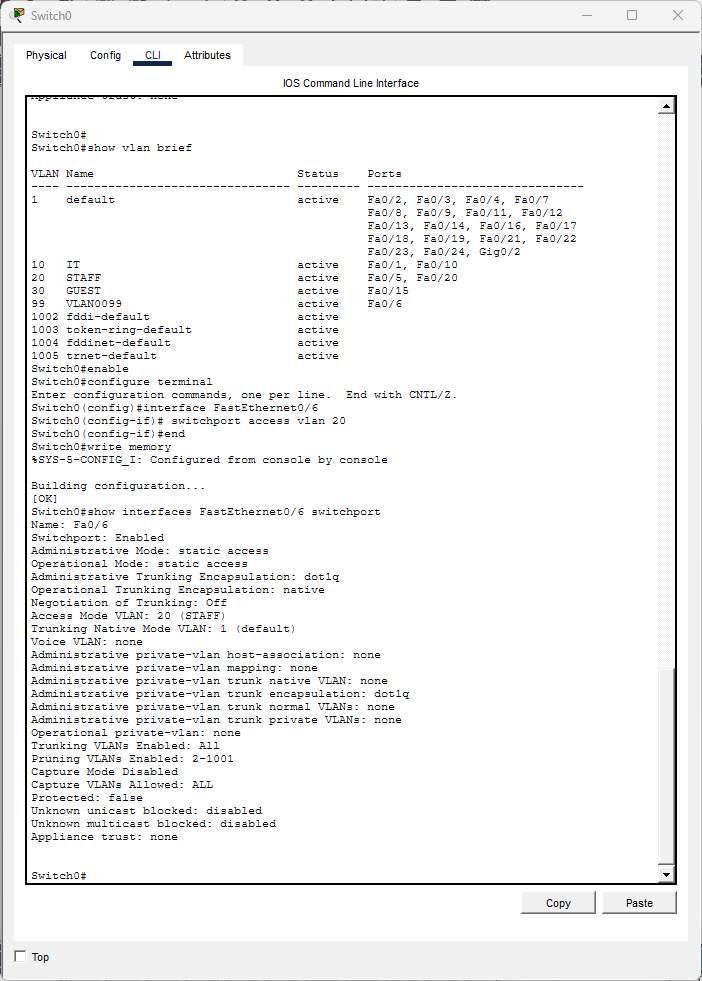
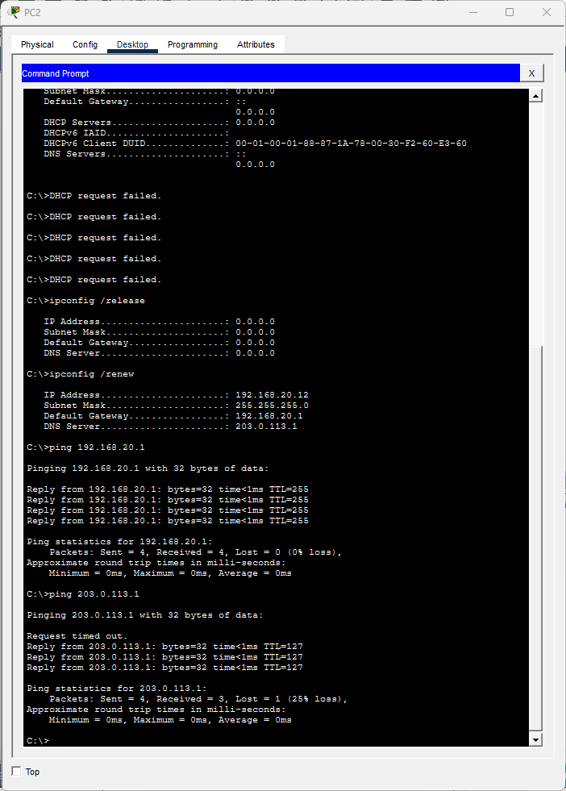

# Ticket #T05: "The new hire's PC won't connect to anything"

**[← Back to lab overview](../README.md)**

**Affected user:** PC2 (VLAN 20 Staff, new hire)
**Severity:** Sev-C
**Packet Tracer file:** [`packet-tracer-files/SOHO-Lab-01-t05.pkt`](../packet-tracer-files/SOHO-Lab-01-t05.pkt)

---

## Reported symptom (from IT)

> *"I just set up the new intern at the desk by the window. Their PC has link lights but can't get online. Everyone else in the cubicle row is fine."*

## Diagnosis

### 1. Check PC state

`ipconfig /all` on PC2 shows all fields `0.0.0.0`. No DHCP lease.



### 2. Physical check on the cable's link light

Green link lights on both ends of PC2's cable. Layer 1 and 2 between PC and switch are fine.



### 3. Interpret the symptom pattern

**Key insight:** green link + no DHCP on a single PC (while neighbors work) = most likely a switchport VLAN problem, not a DHCP or cable issue. Contrast with [T02](T02-dhcp-pool-missing.md), where *multiple* PCs failed DHCP in the same VLAN; that pointed at the DHCP pool. Here, only one PC, so check the port.

### 4. Inspect the switchport assignment

On Switch0, `show interfaces FastEthernet0/6 switchport` shows Access Mode VLAN is `99`, not the expected `20`.



### 5. Verify VLAN 99 is not part of the network design

`show vlan brief` shows VLAN 99 either doesn't exist in the database or exists only as Fa0/6's lonely member. It's not part of the documented topology.



## Root cause

Switchport Fa0/6 was misassigned to VLAN 99, a VLAN with no DHCP pool, no router sub-interface, and no trunk membership. The PC is alive on the wire but stranded on an island VLAN.

## Fix

Reassign Fa0/6 to VLAN 20:

```
enable
configure terminal
interface FastEthernet0/6
 switchport access vlan 20
end
write memory
```



## Verification

`show interfaces Fa0/6 switchport` now shows VLAN 20; PC2 renews DHCP and pings succeed.




---

**[← Back to lab overview](../README.md)**
