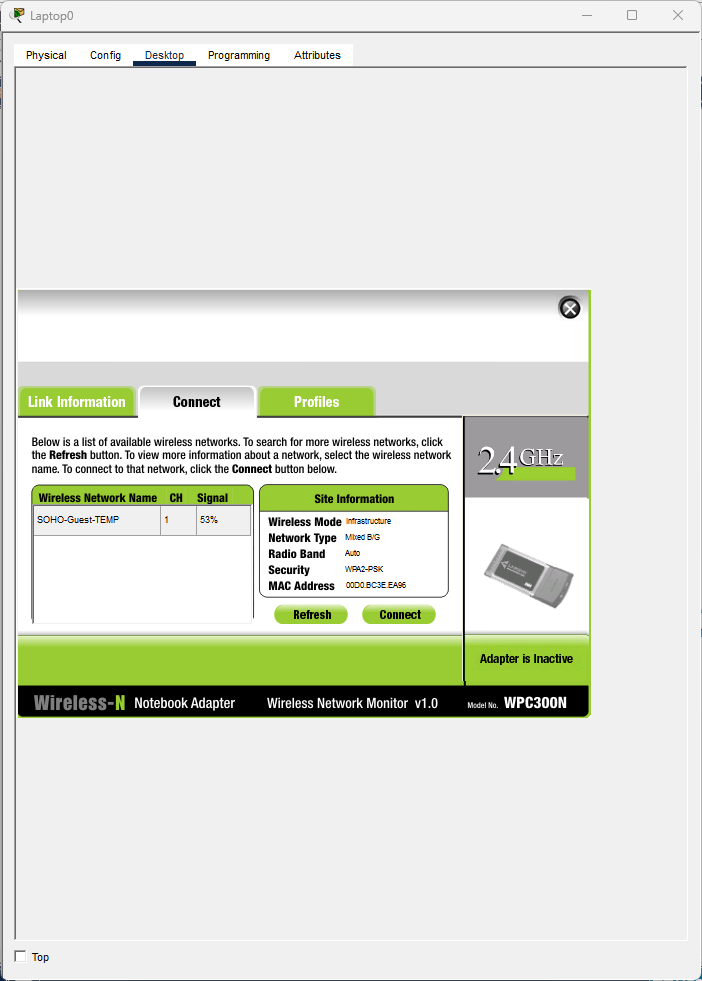
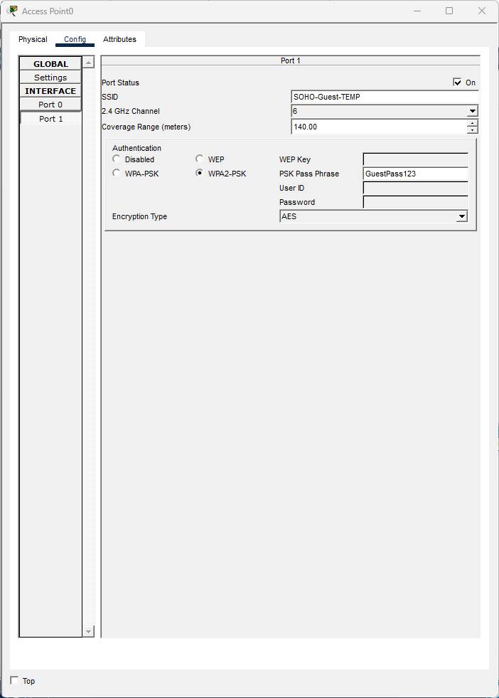
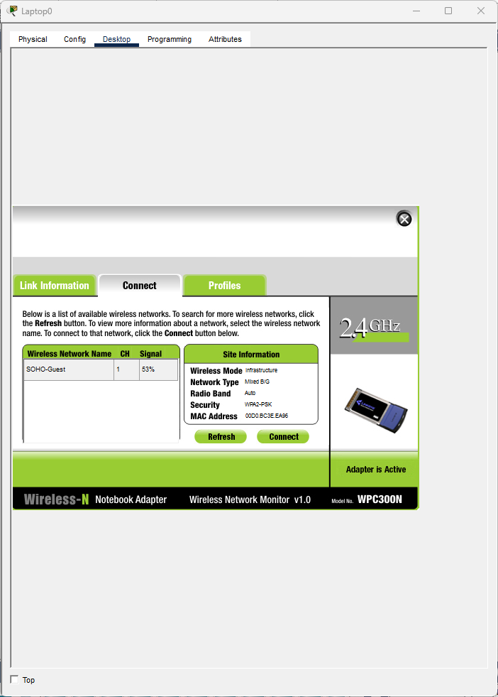
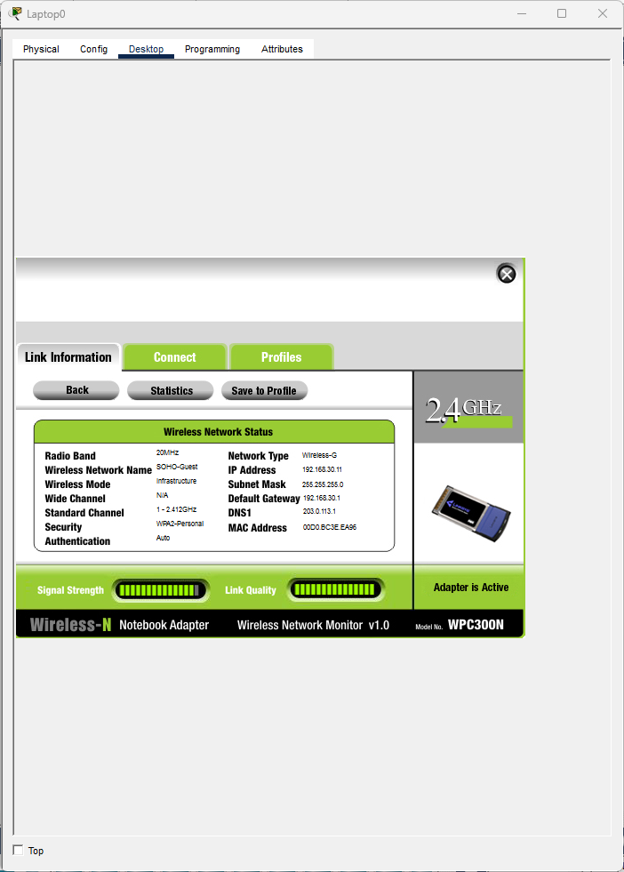
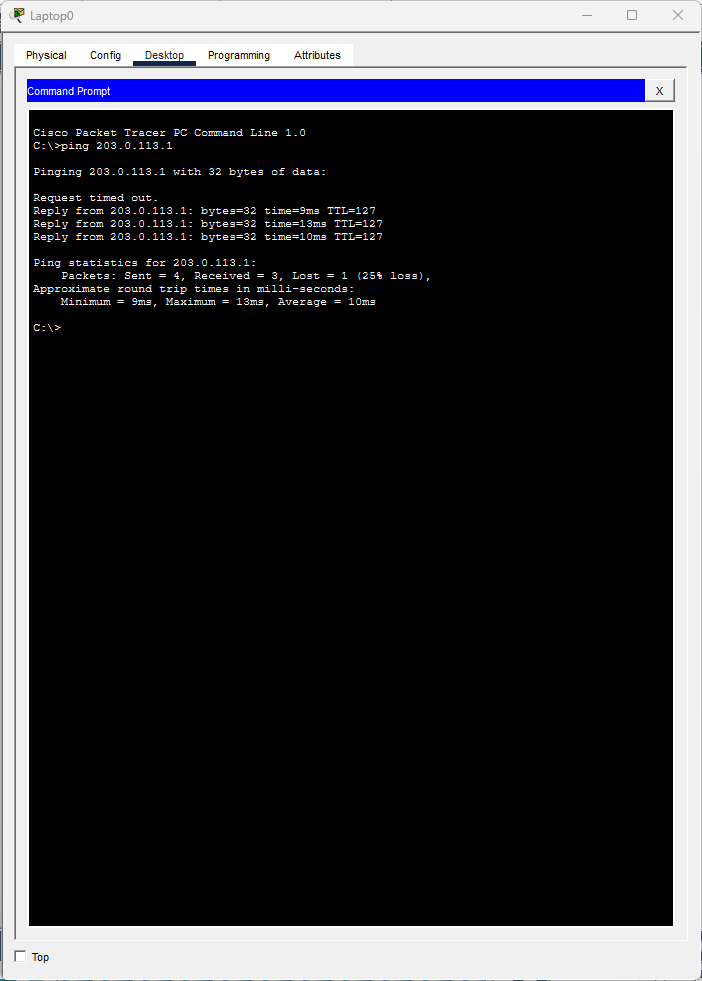

# Ticket #T07: "I can't get on the guest Wi-Fi"

**[← Back to lab overview](../README.md)**

**Affected user:** Visiting contractor (Laptop0)
**Severity:** Sev-C
**Packet Tracer file:** [`packet-tracer-files/SOHO-Lab-01-t07.pkt`](../packet-tracer-files/SOHO-Lab-01-t07.pkt)

---

## Reported symptom

> *"Your Wi-Fi name isn't showing up on my laptop. I see 'SOHO-Guest-TEMP' but nothing called 'SOHO-Guest' like the guest card said."*

## Diagnosis

### 1. Scan for available SSIDs

On Laptop0, PC Wireless → Connect → Refresh. Only `SOHO-Guest-TEMP` appears. The documented SSID `SOHO-Guest` is absent.

### 2. Inspect the AP's SSID config

On Access Point0, Config → Port 1 → SSID field shows `SOHO-Guest-TEMP`.

## Root cause

Access Point0's broadcast SSID was changed from `SOHO-Guest` to `SOHO-Guest-TEMP` without updating the documented guest-card information.

## Fix

Restore SSID to `SOHO-Guest` on the AP.

## Verification

Laptop sees `SOHO-Guest`, connects with the documented passphrase, obtains DHCP, pings external.

---

## Note on differentiating wireless tickets

This ticket and [T04](T04-wrong-wifi-psk.md) look similar on the surface. Both are "I can't get on Wi-Fi." The first diagnostic step distinguishes them cleanly:

- **SSID not visible at all** → check the AP's SSID broadcast (this ticket, T07).
- **SSID visible but won't authenticate** → check the AP's PSK / auth config ([T04](T04-wrong-wifi-psk.md)).

Asking one question up front saves a lot of time.

---

**[← Back to lab overview](../README.md)**
